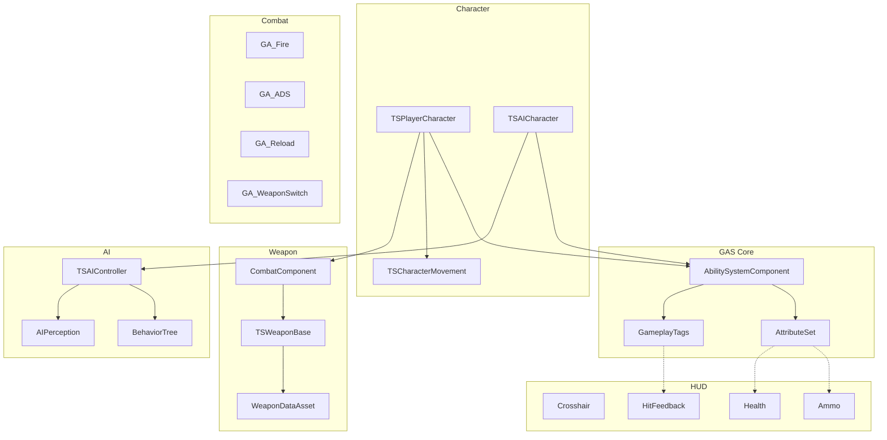

# COD 式 TPS 最小可实现 DEMO — 系统规格说明与实现计划

## 项目基础

- **引擎**: UE 5.8.0
- **起点**: Third Person Blueprint Template (已有角色移动、Enhanced Input、Mannequin 动画)
- **架构**: GAS (Gameplay Ability System)
- **实现方式**: C++ 为主，UI/配置/动画蓝图用蓝图
- **模式**: 单人 vs AI
- **代码命名前缀**: `TS` (TPS Shooter)，模块名 `AI_TPSDemo2`

---

## 子开发文档索引

每个模块的详细开发文档（核心目标、开发地图、状态机/互斥表、量化验收标准、可视化测试证据要求）位于 `tps-demo-modules/` 子目录：

- 阶段0 基础设施: [tps-demo-modules/phase0-foundation.md](tps-demo-modules/phase0-foundation.md) — CP0
- 模块1 GAS 核心: [tps-demo-modules/module-01-gas-core.md](tps-demo-modules/module-01-gas-core.md) — CP1
- 模块2 角色系统: [tps-demo-modules/module-02-character.md](tps-demo-modules/module-02-character.md) — CP2
- 模块10a 输入骨架: [tps-demo-modules/module-10a-input.md](tps-demo-modules/module-10a-input.md) — CP10a
- 模块3 移动系统: [tps-demo-modules/module-03-movement.md](tps-demo-modules/module-03-movement.md) — CP3
- 模块4 武器系统: [tps-demo-modules/module-04-weapon.md](tps-demo-modules/module-04-weapon.md) — CP4
- 模块5 战斗能力: [tps-demo-modules/module-05-combat.md](tps-demo-modules/module-05-combat.md) — CP5
- 模块6 生命与伤害: [tps-demo-modules/module-06-health.md](tps-demo-modules/module-06-health.md) — CP6
- 模块9 HUD/UI: [tps-demo-modules/module-09-hud.md](tps-demo-modules/module-09-hud.md) — CP9
- 模块7 命中反馈: [tps-demo-modules/module-07-feedback.md](tps-demo-modules/module-07-feedback.md) — CP7
- 模块8 AI 系统: [tps-demo-modules/module-08-ai.md](tps-demo-modules/module-08-ai.md) — CP8
- 模块10b 动画系统: [tps-demo-modules/module-10b-anim.md](tps-demo-modules/module-10b-anim.md) — CP10b
- 集成 测试关卡: [tps-demo-modules/integration-test-level.md](tps-demo-modules/integration-test-level.md) — CP-Final

> 测试证据统一存放于 `docs/evidence/<module>/`。所有检查点放行必须以截图/帧序列/录屏等可视化证据为准，不得仅凭日志、控件坐标或 headless 结果判定。

---

## 命名与目录约定

- C++ 源码组织 (在 `Source/AI_TPSDemo2/` 下分子目录):
  - `Core/` — GameMode, PlayerController, AttributeSet, ASC, GA 基类
  - `Character/` — CharacterBase, PlayerCharacter, AICharacter, MovementComponent
  - `Weapon/` — WeaponBase, WeaponDataAsset, CombatComponent
  - `Abilities/` — GA_Fire, GA_ADS, GA_Reload, GA_WeaponSwitch, GA_Sprint, GA_Slide, GE_*
  - `AI/` — AIController, BT 节点
  - `UI/` — PlayerHUD, Widget C++ 基类
- 蓝图资产组织 (在 `Content/TPS/` 下): `Blueprints/`, `Abilities/`, `Weapons/`, `Input/`, `UI/`, `AI/`, `Anim/`, `Maps/`
- Native GameplayTags 集中在 `Core/TSGameplayTags.h/.cpp` 中用 `UE_DEFINE_GAMEPLAY_TAG` 声明

---

## 系统模块总览




---

## 实现里程碑与构建顺序

按依赖关系分为 4 个阶段，每个阶段末尾有一个集成检查点。先搭可运行的最小闭环 (移动+射击+受伤+死亡)，再补 AI、反馈和动画打磨。


- **阶段 1 (M1, M2, M10a, M3)**: 角色能在场景里跑/冲刺/滑铲/蹲，ASC 正常工作 → 检查点 CP-Phase1
- **阶段 2 (M4, M5, M6)**: 能开枪、ADS、换弹、切枪，命中目标扣血并死亡 → 检查点 CP-Phase2
- **阶段 3 (M9, M7, M8)**: 有 HUD 显示、命中反馈，AI 能巡逻发现并攻击玩家 → 检查点 CP-Phase3
- **阶段 4 (M10b, 关卡)**: 动画接入、测试关卡搭建、端到端验收 → 检查点 CP-Final

---

## 阶段 0: 基础设施

> 详细开发文档: [tps-demo-modules/phase0-foundation.md](tps-demo-modules/phase0-foundation.md)

**任务:**

1. 修改 `Source/AI_TPSDemo2/AI_TPSDemo2.Build.cs`，`PublicDependencyModuleNames` 添加: `GameplayAbilities`, `GameplayTags`, `GameplayTasks`, `EnhancedInput`, `AIModule`, `NavigationSystem`, `UMG`, `Slate`, `SlateCore`。
2. 删除占位类 `MyClass.h/.cpp`。
3. 在 `Config/DefaultGame.ini` 启用 `+GameplayTagTableList` 或采用 native tag (推荐 native)。
4. `git init` + `.gitignore` (UE 标准: 忽略 `Binaries/ Intermediate/ Saved/ DerivedDataCache/`)，首次提交。
5. 将本设计文档拷贝到 `docs/specs/2026-06-26-tps-demo-design.md`。

**检查点 CP0 (验收标准):**

- [ ] 项目能通过编译 (Development Editor)，无 GAS 链接错误
- [ ] 编辑器能正常打开 `Lvl_ThirdPerson`
- [ ] `git log` 有首次提交，`Saved/` `Intermediate/` 未被跟踪

---

## 模块 1: GAS 核心搭建

> 详细开发文档: [tps-demo-modules/module-01-gas-core.md](tps-demo-modules/module-01-gas-core.md)

### 系统规格

`**UTSGameplayTags` (Core/TSGameplayTags.h)** — native tag 单例，集中声明:

```
State.Movement.Sprinting / Sliding / Crouching
State.Combat.ADS / Firing / Reloading
State.Weapon.Switching
State.Dead
Ability.Fire / ADS / Reload / Sprint / Slide / WeaponSwitch   (用于 Ability 输入映射)
Event.Combat.Hit / Kill / TakeDamage / Death
Weapon.Slot.Primary / Secondary
Cooldown.Slide
```

`**UTSAbilitySystemComponent` (继承 `UAbilitySystemComponent`)**

- `void GrantStartupAbilities(const TArray<TSubclassOf<UGameplayAbility>>& Abilities)`
- 输入映射: `AbilityInputTagPressed(FGameplayTag)` / `AbilityInputTagReleased(FGameplayTag)` — 遍历可激活能力按 tag 匹配

`**UTSAttributeSet` (继承 `UAttributeSet`)** — 属性用 `ATTRIBUTE_ACCESSORS` 宏:

- `Health` (默认 100), `MaxHealth` (100)
- `Damage` (Meta Attribute，仅作伤害管线中转，不复制)
- 覆写 `PreAttributeChange` (clamp), `PostGameplayEffectExecute` (伤害结算见模块 6)

`**UTSWeaponAttributeSet` (继承 `UAttributeSet`)**

- `AmmoInClip`, `MaxClipSize`, `ReserveAmmo`
- 注: DEMO 阶段武器弹药也可直接放在武器实例上 (见模块 4 决策点)；若走 GAS 属性则用本类

`**UTSGameplayAbility` (继承 `UGameplayAbility`)** — 所有能力基类

- `FGameplayTag InputTag` (用于输入绑定)
- `EAbilityActivationPolicy` (OnInputTriggered / WhileInputActive / OnSpawn)
- 提供 `GetTSCharacterFromActorInfo()` 等便捷访问器

### 任务

1. 创建 native tags 文件并定义全部 tag。
2. 实现 ASC (含输入映射函数)。
3. 实现两个 AttributeSet。
4. 实现 GA 基类。

### 检查点 CP1 (验收标准)

- [ ] 编译通过
- [ ] 用 `LogAbilitySystem` 或临时日志确认 ASC 可被创建、AttributeSet 注册成功
- [ ] 控制台 `showdebug abilitysystem` 能看到 Health/MaxHealth 属性值
- [ ] 所有 GameplayTag 在编辑器 Tag 管理器中可见且无重复

---

## 模块 2: 角色系统

> 详细开发文档: [tps-demo-modules/module-02-character.md](tps-demo-modules/module-02-character.md)

### 系统规格

`**ATSCharacterBase` (继承 `ACharacter`, 实现 `IAbilitySystemInterface`)**

- 构造函数用 `ObjectInitializer.SetDefaultSubobjectClass<UTSCharacterMovementComponent>(...)` 替换移动组件
- 成员: `UTSAbilitySystemComponent* AbilitySystemComponent`, `UTSAttributeSet* AttributeSet`, `UTSWeaponAttributeSet* WeaponAttributeSet`
- `TArray<TSubclassOf<UTSGameplayAbility>> DefaultAbilities` (蓝图可配)
- `TArray<TSubclassOf<UGameplayEffect>> DefaultEffects` (初始化属性)
- `virtual void InitAbilityActorInfo()` — Player 在 PossessedBy + OnRep_PlayerState 调用，AI 在 PossessedBy 调用
- `GetAbilitySystemComponent()` 返回 ASC

`**ATSPlayerCharacter` (继承 `ATSCharacterBase`)**

- `USpringArmComponent* CameraBoom` (TargetArmLength≈250, SocketOffset≈(0,50,60) 越肩)
- `UCameraComponent* FollowCamera`
- `UTSCombatComponent* CombatComponent`
- `bUseControllerRotationYaw=true` + `bOrientRotationToMovement=false` (COD 式越肩 strafe，角色始终面向相机)
- 在 `PossessedBy` 与 `OnRep_PlayerState` 中初始化 ASC

`**ATSAICharacter` (继承 `ATSCharacterBase`)**

- `AIControllerClass = ATSAIController`
- `AutoPossessAI = PlacedInWorldOrSpawned`
- 默认武器配置 (主武器 DataAsset 引用)

### 决策点

- 角色朝向策略: COD 越肩通常角色始终面向相机方向 (strafe 动画)。建议 `bOrientRotationToMovement=false` + `bUseControllerRotationYaw=true`，配合 AimOffset/Strafe 混合空间。

### 任务

1. 创建 `ATSCharacterBase` + ASC/AttributeSet 初始化逻辑。
2. 创建 `ATSPlayerCharacter` (相机+组件)。
3. 创建 `ATSAICharacter`。
4. 创建蓝图 `BP_TSPlayerCharacter` / `BP_TSEnemy`，配置 DefaultAbilities/Effects。
5. 修改 GameMode 默认 Pawn 为 `BP_TSPlayerCharacter`。

### 检查点 CP2 (验收标准)

- [ ] PIE 运行后玩家角色生成，相机为越肩第三人称视角
- [ ] `showdebug abilitysystem` 显示玩家 ASC 已 init、Health=100
- [ ] 移动/视角控制正常 (沿用模板输入)
- [ ] 场景中放置一个 `BP_TSEnemy` 能生成且持有 ASC

---

## 模块 10a: 输入骨架 (提前到核心闭环)

> 详细开发文档: [tps-demo-modules/module-10a-input.md](tps-demo-modules/module-10a-input.md)

### 系统规格

扩展现有 `IMC_Default`，新增 Input Actions (放 `Content/TPS/Input/`):


| Input Action      | 类型     | 默认键             | 映射 Ability Tag         |
| ----------------- | ------ | --------------- | ---------------------- |
| `IA_Fire`         | Bool   | 鼠标左键            | `Ability.Fire`         |
| `IA_ADS`          | Bool   | 鼠标右键            | `Ability.ADS`          |
| `IA_Reload`       | Bool   | R               | `Ability.Reload`       |
| `IA_Sprint`       | Bool   | Left Shift      | `Ability.Sprint`       |
| `IA_Crouch`       | Bool   | C               | (原生 Crouch)            |
| `IA_Slide`        | Bool   | Left Ctrl (冲刺中) | `Ability.Slide`        |
| `IA_WeaponSlot1`  | Bool   | 1               | `Ability.WeaponSwitch` |
| `IA_WeaponSlot2`  | Bool   | 2               | `Ability.WeaponSwitch` |
| `IA_WeaponScroll` | Axis1D | 鼠标滚轮            | `Ability.WeaponSwitch` |


- 在 `ATSPlayerCharacter::SetupPlayerInputComponent` 中: 战斗类输入统一调用 `ASC->AbilityInputTagPressed/Released(Tag)`；移动/视角直接调用函数。
- 可选: 用 `UInputConfig` DataAsset 维护 InputAction↔Tag 映射表。

### 检查点 CP10a (验收标准)

- [ ] 各按键按下时有日志输出对应 tag (临时验证)
- [ ] 与现有 Move/Look/Jump 不冲突

---

## 模块 3: 移动系统

> 详细开发文档: [tps-demo-modules/module-03-movement.md](tps-demo-modules/module-03-movement.md)

### 系统规格

`**UTSCharacterMovementComponent` (继承 `UCharacterMovementComponent`)**

- Walk: `MaxWalkSpeed = 450`
- Sprint: `SprintSpeed = 750` (仅前向，受 ADS 状态压制)
- Crouch: 启用 `GetNavAgentPropertiesRef().bCanCrouch=true`, `MaxWalkSpeedCrouched=250`
- Slide: 自定义 `CustomMovementMode = CMOVE_Slide`
  - `SlideEnterImpulse ≈ 900`, `SlideMinSpeed`, 持续 `~0.8s` 或速度衰减到阈值结束
  - 降低 capsule 半高，结束后恢复或转 Crouch
- 提供 `bWantsToSprint` / `StartSlide()` / `EndSlide()` 接口供 GA 调用

`**UGA_Sprint` (继承 `UTSGameplayAbility`)**

- ActivationPolicy = WhileInputActive
- Activate: 加 `State.Movement.Sprinting` tag → 设置 Movement->bWantsToSprint=true
- End (松开/无前向输入/开火/ADS): 移除 tag，恢复速度
- ActivationBlockedTags: `State.Combat.ADS`

`**UGA_Slide` (继承 `UTSGameplayAbility`)**

- 触发: 仅当持有 `State.Movement.Sprinting` 时可激活
- Cost/Cooldown: `GE_Cooldown_Slide` (`Cooldown.Slide`, ~1.5s)
- Activate: 播放 Slide Montage (可后置到阶段4) → 调用 Movement->StartSlide → 用 AbilityTask 计时/监听结束 → EndAbility

**Crouch**: 直接用引擎 `Character::Crouch()/UnCrouch()`，输入在角色类里处理 + 加 `State.Movement.Crouching` tag。

### 检查点 CP3 (验收标准)

- [ ] 按住 Shift 前进时移动速度提升至 SprintSpeed
- [ ] 松开 Shift / 改为后退时退出冲刺
- [ ] 冲刺中按 Ctrl 触发滑铲: capsule 降低、有前冲、~0.8s 后结束
- [ ] 滑铲有冷却 (连续触发被阻挡)
- [ ] 按 C 蹲下，速度降低，capsule 降低
- [ ] 上述状态都能在 `showdebug abilitysystem` 的 tag 列表中正确反映

---

## 模块 4: 武器系统

> 详细开发文档: [tps-demo-modules/module-04-weapon.md](tps-demo-modules/module-04-weapon.md)

### 系统规格

`**UTSWeaponDataAsset` (继承 `UPrimaryDataAsset`)**

- `FName WeaponName`, `EWeaponSlot Slot` (Primary/Secondary)
- `TSubclassOf<ATSWeaponBase> WeaponClass`
- `float Damage`, `float FireRate` (秒/发), `bool bAutomatic`
- `int32 ClipSize`, `int32 MaxReserveAmmo`, `float ReloadTime`
- `float SpreadHip` (度), `float SpreadADS` (度), `float MaxRange` (默认 10000)
- `UCurveFloat* RecoilCurve` (后坐力随连发上升)
- `UAnimMontage* FireMontage/ReloadMontage/EquipMontage`
- `UNiagaraSystem* MuzzleFX`, `USoundBase* FireSound`
- `float ADS_FOV` (默认 55), `FVector ADS_CameraOffset`

`**ATSWeaponBase` (继承 `AActor`)**

- `USkeletalMeshComponent* WeaponMesh` (含 `Muzzle` socket)
- `UTSWeaponDataAsset* WeaponData`
- 运行时弹药: `int32 CurrentAmmo`, `int32 CurrentReserve`
- `bool CanFire()`, `void ConsumeAmmo()`, `int32 GetReloadAmount()`
- `FVector GetMuzzleLocation()`

`**UTSCombatComponent` (继承 `UActorComponent`)**

- `TArray<ATSWeaponBase*> WeaponSlots` (size 2)
- `ATSWeaponBase* CurrentWeapon`, `int32 CurrentSlotIndex`
- `void EquipWeapon(int32 Slot)`, `void AttachWeaponToHand()` (附加到角色手部 socket `hand_r`)
- `void SwitchToSlot(int32)`, `void SwitchNext()`
- 初始化: 根据角色 DefaultWeapons 生成武器并附加

### 决策点

- 弹药数据存放: **推荐放在 `ATSWeaponBase` 实例上** (DEMO 更直接)，`UTSWeaponAttributeSet` 留作后续 GAS 化扩展。HUD 直接读当前武器弹药。

### 任务

1. 创建 WeaponDataAsset + 枚举 `EWeaponSlot`。
2. 创建 WeaponBase Actor。
3. 创建 CombatComponent (持有/附加/切换)。
4. 制作 2 个武器 DataAsset (AR / Pistol) + 武器蓝图 (临时用基础静态/骨骼网格)。
5. 角色出生时装备主武器并附加到手部 socket。

### 检查点 CP4 (验收标准)

- [ ] 玩家出生时手上附着主武器网格 (位置正确)
- [ ] CombatComponent 持有 2 把武器，CurrentWeapon 指向主武器
- [ ] 调试调用 SwitchToSlot 能切换当前武器引用 (网格切换可后置)
- [ ] 武器弹药字段从 DataAsset 正确初始化

---

## 模块 5: 射击与战斗能力

> 详细开发文档: [tps-demo-modules/module-05-combat.md](tps-demo-modules/module-05-combat.md)

### 系统规格

`**UGA_Fire`**

- ActivationPolicy: 自动武器 WhileInputActive，半自动 OnInputTriggered
- 流程: 检查 `CanFire` (有弹药/未换弹/未切枪) → 计算射线 (相机中心 → 准心方向，加散布: ADS 用 SpreadADS) → `LineTraceSingleByChannel` (ECC `Weapon` 自定义通道) → 命中则 `MakeOutgoingGameplayEffectSpec(GE_Damage)` 设置 SetByCaller Damage → `ApplyGameplayEffectSpecToTarget`
- 消耗弹药、应用后坐力 (基于 RecoilCurve 给 Controller 加 Pitch/Yaw)
- 触发 MuzzleFX、FireSound、弹壳、FireMontage
- 发送 `Event.Combat.Hit` (命中) 给自身 ASC (供反馈层)
- 自动武器用 AbilityTask + FireRate 定时循环

`**UGA_ADS`**

- ActivationPolicy: WhileInputActive
- Activate: 加 `State.Combat.ADS` tag，插值 Camera FOV→ADS_FOV、SpringArm Offset→ADS_CameraOffset，降低移动速度 (压制 Sprint)
- End: 还原 FOV/Offset/速度，移除 tag

`**UGA_Reload`**

- 条件: CurrentAmmo < ClipSize 且 Reserve > 0 且未在换弹
- Activate: 加 `State.Combat.Reloading`，播放 ReloadMontage，用 `PlayMontageAndWait` → 完成回调结算弹药 (从 Reserve 补到 Clip)
- ActivationBlockedTags: `State.Weapon.Switching`, `State.Dead`
- 可被切枪/死亡取消

`**UGA_WeaponSwitch**`

- 条件: 目标槽位有武器且 != 当前
- Activate: 加 `State.Weapon.Switching`，播放 Equip Montage → 在 notify/延时点调用 CombatComponent->SwitchToSlot → 结束移除 tag
- 取消进行中的 Reload

**GameplayEffects**

- `GE_Damage`: Instant，Modifier 对 `UTSAttributeSet::Damage` 用 SetByCaller (`Data.Damage`)，伤害结算在 AttributeSet 中转到 Health (模块 6)
- `GE_InitAttributes`: Instant/Infinite，初始化 Health/MaxHealth
- `GE_Cooldown_Slide`: Duration，授予 `Cooldown.Slide`

### 检查点 CP5 (验收标准)

- [ ] 左键开火: 自动武器连发、半自动单发，受 FireRate 限制
- [ ] 射线从准心方向射出，命中物体有 debug 命中点 (临时 `DrawDebugLine`)
- [ ] 右键 ADS: FOV 收窄、相机贴近、散布减小、移速降低；松开还原
- [ ] R 换弹: 播放时长后弹药从备弹补充，换弹中无法开火
- [ ] 1/2/滚轮切枪: 当前武器切换，换弹被打断
- [ ] 命中带 ASC 的目标时，目标 Health 下降 (配合模块 6 验证)

---

## 模块 6: 生命值与伤害系统

> 详细开发文档: [tps-demo-modules/module-06-health.md](tps-demo-modules/module-06-health.md)

### 系统规格

`**UTSAttributeSet::PostGameplayEffectExecute`**

- 若结算的是 `Damage` meta attribute:
  - `LocalDamage = GetDamage(); SetDamage(0)`
  - `NewHealth = clamp(GetHealth() - LocalDamage, 0, GetMaxHealth())`
  - 取来源 Controller/Actor (从 EffectContext) 用于反馈与击杀归属
  - 发送 `Event.Combat.TakeDamage` 给受击者 (payload 带来源、伤害值)
  - 若 `NewHealth <= 0` 且未死: 标记死亡 → 见死亡流程；并发送 `Event.Combat.Kill` 给来源
- `PreAttributeChange`: clamp MaxHealth 变化时按比例调整 Health

**死亡流程 (`ATSCharacterBase::HandleDeath`)**

- 加 `State.Dead` tag，`ASC->CancelAllAbilities()`
- 禁用碰撞/输入，启用 Ragdoll (`SetSimulatePhysics`) 或播放死亡 Montage
- AI: 通知 AIController 停止 BT、`Destroy` 延时清理
- Player: 显示 Game Over 或延时 `RestartPlayer` 重生

### 检查点 CP6 (验收标准)

- [ ] 射击敌人，敌人 Health 按武器 Damage 递减 (`showdebug abilitysystem` 可见)
- [ ] 敌人 Health 归零时进入死亡 (Ragdoll/动画)，不再行动
- [ ] 玩家被 (临时) 伤害源击中也会扣血并触发死亡流程
- [ ] 死亡后角色能力被取消、不可再开火移动
- [ ] 击杀事件 `Event.Combat.Kill` 正确发给击杀者 (日志验证)

---

## 模块 9: HUD/UI 系统

> 详细开发文档: [tps-demo-modules/module-09-hud.md](tps-demo-modules/module-09-hud.md)

### 系统规格

`**ATSPlayerHUD` (继承 `AHUD`) 或在 PlayerController 用 `CreateWidget`**


| Widget            | C++/BP | 数据来源                                | 行为                        |
| ----------------- | ------ | ----------------------------------- | ------------------------- |
| `WBP_Crosshair`   | BP     | 当前武器/移动/ADS 状态                      | 4 段线，扩散随移动/射击放大、ADS 收紧或隐藏 |
| `WBP_AmmoDisplay` | BP     | CurrentWeapon (CurrentAmmo/Reserve) | 文本 "30 / 90"              |
| `WBP_HealthBar`   | BP     | AttributeSet Health/MaxHealth       | 进度条                       |
| `WBP_WeaponInfo`  | BP     | CurrentWeapon                       | 武器名/图标                    |
| `WBP_HUDRoot`     | BP     | 容器                                  | 组合以上                      |


- 属性绑定: 用 `ASC->GetGameplayAttributeValueChangeDelegate(HealthAttribute).AddUObject(...)` 驱动 HealthBar；弹药用武器变更/开火回调或轮询。
- 提供 C++ 基类 `UTSUserWidget` (持有角色/ASC 引用) 供蓝图继承。

### 检查点 CP9 (验收标准)

- [ ] 屏幕显示准心、弹药、血条
- [ ] 开火弹药数实时下降，换弹后回满，备弹相应减少
- [ ] 受伤时血条实时下降
- [ ] ADS 时准心收紧/隐藏，移动时准心扩散

---

## 模块 7: 命中反馈系统

> 详细开发文档: [tps-demo-modules/module-07-feedback.md](tps-demo-modules/module-07-feedback.md)

### 系统规格

监听 GameplayEvent (通过 `AbilitySystemComponent->GenericGameplayEventCallbacks` 或在 PlayerController/HUD 注册):

- **Hitmarker**: 收到自身 `Event.Combat.Hit` → 准心处显示 X (~0.15s 淡出)；收到 `Event.Combat.Kill` → 红色/加粗样式 + 击杀音
- **伤害方向指示器**: 收到 `Event.Combat.TakeDamage` → 由 payload 来源位置计算相对玩家朝向的角度 → 屏幕边缘对应方向显示红色弧形 (~1.5s 淡出)
- **击杀确认**: `Event.Combat.Kill` → 音效 + 可选 KillFeed 文本

实现: `WBP_HitMarker`, `WBP_DamageIndicator` + 在 HUD 中订阅事件并驱动。

### 检查点 CP7 (验收标准)

- [ ] 命中敌人时准心出现 hitmarker
- [ ] 击杀敌人时 hitmarker 变击杀样式 + 播放击杀音
- [ ] 玩家受击时屏幕边缘出现指向伤害来源方向的红色指示器并淡出

---

## 模块 8: AI 系统

> 详细开发文档: [tps-demo-modules/module-08-ai.md](tps-demo-modules/module-08-ai.md)

### 系统规格

`**ATSAIController` (继承 `AAIController`)**

- `UAIPerceptionComponent` + `UAISenseConfig_Sight` (视距≈1500, 视野角≈90, 失去视野记忆≈5s)
- `OnTargetPerceptionUpdated` → 设置 Blackboard `TargetActor` / `HasLineOfSight`
- `OnPossess` 中 `RunBehaviorTree(BT_Enemy)`

**Blackboard Keys**: `TargetActor` (Object), `PatrolLocation` (Vector), `HasLineOfSight` (Bool), `IsDead` (Bool)

**Behavior Tree (BT_Enemy) 逻辑**

- Root Selector:
  1. Decorator `IsDead` → 停止
  2. Sequence [有 TargetActor]: 面向目标 → (射程&视野内) 射击 / 否则 MoveTo 目标
  3. Sequence [巡逻]: `FindPatrolPoint` → MoveTo → Wait

**自定义节点 (C++)**

- `UBTTask_FireWeapon`: 调用 AI 角色 `ASC->TryActivateAbility(GA_Fire)` 持续一小段时间 (点射)
- `UBTTask_FindPatrolPoint`: 用 `UNavigationSystemV1::GetRandomReachablePointInRadius` 或预设 PatrolPath
- `UBTService_UpdateTarget` (可选): 周期刷新视野/射程状态
- `UBTDecorator_HasAmmo` / AI 简化为无限弹药或自动换弹

### 检查点 CP8 (验收标准)

- [ ] AI 在出生点附近巡逻 (NavMesh 路径移动)
- [ ] 玩家进入视野后 AI 切换为追击/攻击
- [ ] AI 在射程内朝玩家开火，能对玩家造成伤害 (触发模块 6/7)
- [ ] 玩家离开视野一段时间后 AI 回到巡逻
- [ ] AI 死亡后停止所有行为

---

## 模块 10b: 动画系统

> 详细开发文档: [tps-demo-modules/module-10b-anim.md](tps-demo-modules/module-10b-anim.md)

### 系统规格

`**ABP_TSCharacter` (Animation Blueprint，蓝图为主)**

- Locomotion StateMachine: Idle / Walk / Run / Sprint / Crouch / Slide，使用 Strafe 混合空间 (前后左右)
- AimOffset: 基于 Controller Pitch/Yaw 的上下左右瞄准偏移
- Layered Blend per Bone: 以 `spine_01` 为界，上半身播放 Fire/Reload/Equip Montage，下半身保持移动
- 通过 `bIsSprinting/bIsADS/bIsCrouching/bIsSliding` 等变量 (从 ASC tag 或角色读取) 驱动状态
- (可选) IK: 左手对齐武器握把 (Two Bone IK + 武器 socket)

**Montage 接入**: 模块 5 中各 GA 的 `PlayMontageAndWait` 指向对应 Montage；notify 触发开火/换弹结算点。

**资源策略**: 先用 Mannequin 自带动画占位，武器持握/射击/换弹动画后续用 Mixamo / Marketplace 补充。

### 检查点 CP10b (验收标准)

- [ ] 移动/冲刺/蹲伏/滑铲有对应动画状态切换
- [ ] 瞄准时角色上半身随视角俯仰 (AimOffset)
- [ ] 开火/换弹播放上半身 Montage 且不打断下半身移动
- [ ] ADS/腰射姿态有区分 (至少 FOV+准心，理想含姿态)

---

## 集成: 测试关卡与端到端验收

> 详细开发文档: [tps-demo-modules/integration-test-level.md](tps-demo-modules/integration-test-level.md)

### 任务

1. 复制 `Lvl_ThirdPerson` 为 `Content/TPS/Maps/Lvl_TPS_Test`，设为默认关卡。
2. 用 `LevelPrototyping` 资产搭建掩体/房间布局。
3. 放置 3-5 个 `BP_TSEnemy` + 巡逻点 (`ATargetPoint` 或自定义 PatrolPath)。
4. 添加 `NavMeshBoundsVolume` 覆盖战斗区域，Build Paths。
5. 设置玩家出生点 (`PlayerStart`)。
6. (可选) 武器/弹药拾取点。

### 检查点 CP-Final (端到端验收)

- [ ] 从主菜单/PIE 进入关卡，玩家以越肩视角出生并装备武器
- [ ] 完整操作闭环: 移动/冲刺/滑铲/蹲 + 开火/ADS/换弹/切枪 全部可用
- [ ] AI 巡逻 → 发现玩家 → 攻击；玩家可击杀 AI，AI 可击杀玩家
- [ ] HUD 正确显示血量/弹药/准心，命中与受击有反馈
- [ ] 一局可玩流程跑通无崩溃 (帧率/报错可接受)

---

## 阶段集成检查点汇总

- **CP-Phase1** (M1+M2+M10a+M3): 角色在关卡中可自由移动/冲刺/滑铲/蹲，ASC+Tag 工作正常
- **CP-Phase2** (M4+M5+M6): 武器射击闭环 + 伤害死亡跑通 (可用一个静止假人验证)
- **CP-Phase3** (M9+M7+M8): HUD + 命中反馈 + AI 对抗成型
- **CP-Final**: 测试关卡端到端验收

---

## 已确定的决策点

1. **角色朝向**: 越肩 strafe — `bOrientRotationToMovement=false` + `bUseControllerRotationYaw=true`，角色始终面向相机方向，动画蓝图使用四方向 Strafe 混合空间 + AimOffset
2. **弹药数据归属**: 存放在 `ATSWeaponBase` 实例上，HUD 直接读当前武器；`UTSWeaponAttributeSet` 留作后续 GAS 化扩展
3. **玩家死亡处理**: 延时自动重生 (死亡 → Ragdoll/动画 → 延时 `RestartPlayer`)
4. **AI 弹药**: 无限弹药 + 周期性自动换弹动画 (简化 BT)
5. **美术/动画资源**: 先用 Mannequin 自带动画占位，武器射击/换弹动画后续用 Mixamo/Marketplace 补充

