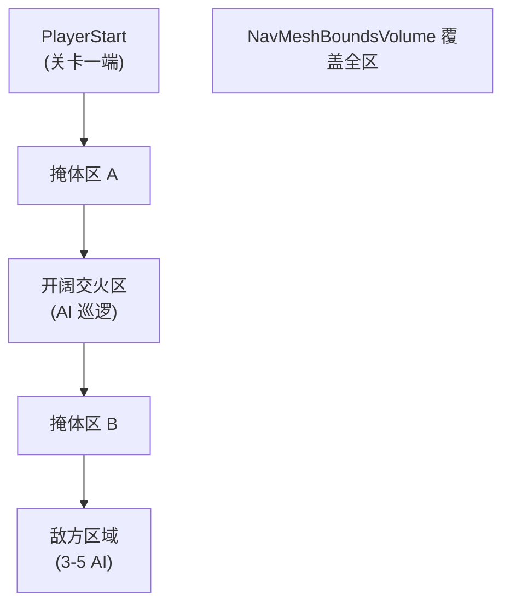
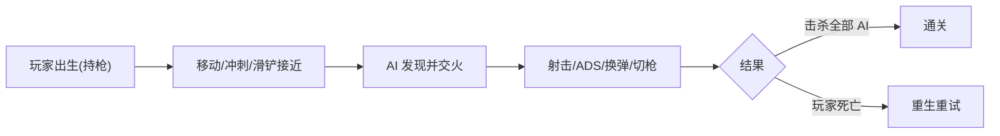

# 集成: 测试关卡与端到端验收 — 开发文档

> 关联主计划: [../cod-style_tps_demo_cce8f423.plan.md](../cod-style_tps_demo_cce8f423.plan.md)
> 阶段: 4 (打磨/集成) | 依赖: 全部模块 | 检查点: CP-Final

---

## 1. 核心目标

把所有系统整合到一个可玩关卡中，搭建掩体战斗场景、放置巡逻 AI、铺设导航网格，完成端到端验收：一局完整的"潜入→交火→击杀/被杀→重生"流程跑通且无崩溃。

---

## 2. 开发地图 (Development Map)

### 2.1 关卡构成清单

| 元素 | 来源 | 数量/参数 |
|---|---|---|
| 基础地形/房间 | `LevelPrototyping` 网格 | 1 主战斗区 |
| 掩体方块 | `SM_Cube` / `SM_Ramp` | ≥8 个，高低错落 |
| AI 敌人 | `BP_TSEnemy` | 3-5 个 |
| 巡逻点 | `ATargetPoint` / PatrolPath | 每 AI 2-3 点 |
| NavMesh | `NavMeshBoundsVolume` | 覆盖整个战斗区 |
| 玩家出生 | `PlayerStart` | 1 |
| 武器拾取 (可选) | 拾取 Actor | 0-2 |

### 2.2 关卡布局示意

### 2.3 端到端流程

---

## 3. 实现步骤

1. 复制 `Lvl_ThirdPerson` 为 `Content/TPS/Maps/Lvl_TPS_Test`，设为默认关卡。
2. 用 LevelPrototyping 资产搭掩体/房间布局。
3. 放置 3-5 个 `BP_TSEnemy` + 巡逻点。
4. 添加 `NavMeshBoundsVolume` 覆盖战斗区，`Build Paths`，用 `P` 键可视化验证。
5. 放置 `PlayerStart`，确认 GameMode/默认 Pawn。
6. （可选）武器/弹药拾取点。

---

## 4. 验收标准 (量化) — CP-Final 端到端

| 编号 | 标准 | 量化指标 |
|---|---|---|
| CPF-1 | 出生就绪 | 进入关卡玩家越肩持枪出生，HUD 完整显示 |
| CPF-2 | 移动闭环 | 走/跑/冲刺/滑铲/蹲全部可用且有动画 |
| CPF-3 | 战斗闭环 | 开火/ADS/换弹/切枪全部可用，命中有反馈 |
| CPF-4 | AI 对抗 | AI 巡逻→发现→攻击；玩家可击杀全部 AI；AI 也能击杀玩家 |
| CPF-5 | 死亡重生 | 玩家死亡 3s 后重生继续；AI 死亡 5s 清理 |
| CPF-6 | NavMesh | AI 能绕掩体寻路，无卡墙/原地抽搐 |
| CPF-7 | 稳定性 | 连续游玩 ≥3 分钟无崩溃；平均帧率 ≥ 45 FPS（PIE）|

---

## 5. 测试证据要求 (必须为可视化证据)

> CP-Final 必须提供一段完整通关录屏作为主证据，禁止用分段日志或 headless 结果拼凑判定。

- **证据 A — 完整通关录屏**: 一镜到底录制从出生到清完所有 AI 的完整流程（含移动/冲刺/滑铲/ADS/换弹/切枪/击杀/受击反馈全部出现）。命名 `CPF-A_full_playthrough.mp4`。
- **证据 B — 死亡重生录屏**: 录制玩家被 AI 击杀→重生→继续战斗。命名 `CPF-B_death_respawn.mp4`。
- **证据 C — NavMesh 截图**: 按 `P` 显示导航网格的关卡俯视截图，绿色覆盖战斗区。命名 `CPF-C_navmesh.png`。
- **证据 D — 帧率截图**: 游玩中 `stat fps` / `stat unit` 截图，显示 ≥45 FPS。命名 `CPF-D_perf.png`。
- 存放 `docs/evidence/integration/`。

---

## 6. 阶段集成检查点汇总 (回顾)

| 检查点 | 覆盖模块 | 主证据 |
|---|---|---|
| CP-Phase1 | M1+M2+M10a+M3 | 移动/冲刺/滑铲/蹲录屏 |
| CP-Phase2 | M4+M5+M6 | 射击→扣血→死亡录屏 |
| CP-Phase3 | M9+M7+M8 | HUD+反馈+AI 交火录屏 |
| CP-Final | 全部 | 完整通关录屏 |
