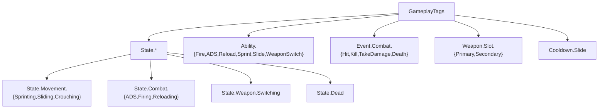

# 模块 1: GAS 核心搭建 — 开发文档

> 关联主计划: [../cod-style_tps_demo_cce8f423.plan.md](../cod-style_tps_demo_cce8f423.plan.md)
> 阶段: 1 (核心闭环) | 依赖: 阶段0 | 检查点: CP1

---

## 1. 核心目标

建立 GAS 运行时骨架：可工作的 AbilitySystemComponent、两套 AttributeSet（角色属性 / 武器属性）、集中式 native GameplayTag、统一的 GameplayAbility 基类与输入映射机制。本模块是所有战斗与移动能力的承载层，自身不实现具体玩法。

---

## 2. 开发地图 (Development Map)

### 2.1 类清单

| 类 | 父类 | 文件 | 职责 |
|---|---|---|---|
| `FTSGameplayTags` | (单例 struct) | `Core/TSGameplayTags.h/.cpp` | native tag 集中声明 |
| `UTSAbilitySystemComponent` | `UAbilitySystemComponent` | `Core/TSAbilitySystemComponent.h/.cpp` | 授予能力 + 输入映射 |
| `UTSAttributeSet` | `UAttributeSet` | `Core/TSAttributeSet.h/.cpp` | Health/MaxHealth/Damage(meta) |
| `UTSWeaponAttributeSet` | `UAttributeSet` | `Core/TSWeaponAttributeSet.h/.cpp` | 弹药属性(预留) |
| `UTSGameplayAbility` | `UGameplayAbility` | `Core/TSGameplayAbility.h/.cpp` | 能力基类 + InputTag |

### 2.2 GameplayTag 层级树

### 2.3 输入→能力激活数据流

### 2.4 属性表

| 属性 | 所属 Set | 默认值 | 复制 | 说明 |
|---|---|---|---|---|
| Health | TSAttributeSet | 100 | 是 | 当前生命 |
| MaxHealth | TSAttributeSet | 100 | 是 | 生命上限 |
| Damage | TSAttributeSet | 0 | 否 (meta) | 伤害中转，结算后清零 |
| AmmoInClip | TSWeaponAttributeSet | 30 | 是 | 预留(DEMO 主用武器实例) |
| MaxClipSize | TSWeaponAttributeSet | 30 | 是 | 预留 |
| ReserveAmmo | TSWeaponAttributeSet | 90 | 是 | 预留 |

---

## 3. 详细规格

- 属性统一用 `GAMEPLAYATTRIBUTE_PROPERTY_GETTER` / `ATTRIBUTE_ACCESSORS` 宏生成访问器。
- `UTSAttributeSet::PreAttributeChange`: clamp `Health ∈ [0, MaxHealth]`。
- `UTSAbilitySystemComponent`:
  - `void GrantStartupAbilities(const TArray<TSubclassOf<UGameplayAbility>>&)`
  - `void AbilityInputTagPressed(const FGameplayTag& InputTag)`
  - `void AbilityInputTagReleased(const FGameplayTag& InputTag)`
- `UTSGameplayAbility`:
  - `FGameplayTag InputTag`
  - `enum class ETSActivationPolicy { OnInputTriggered, WhileInputActive, OnSpawn }`
  - `GetTSCharacterFromActorInfo()` 等便捷访问器。

---

## 4. 实现步骤

1. 创建 `FTSGameplayTags` 单例并用 `UE_DEFINE_GAMEPLAY_TAG_STATIC` / `AddNativeGameplayTag` 注册全部 tag。
2. 实现 `UTSAttributeSet`（属性 + clamp）。
3. 实现 `UTSWeaponAttributeSet`（预留属性）。
4. 实现 `UTSAbilitySystemComponent`（授予 + 输入映射）。
5. 实现 `UTSGameplayAbility` 基类。
6. 编译并用控制台调试验证。

---

## 5. 验收标准 (量化)

| 编号 | 标准 | 量化指标 |
|---|---|---|
| CP1-1 | 编译通过 | 0 error |
| CP1-2 | 属性注册 | `showdebug abilitysystem` 显示 Health=100.0 / MaxHealth=100.0 |
| CP1-3 | Clamp 生效 | 手动施加 -150 伤害 GE 后 Health 显示 0.0（不为负） |
| CP1-4 | Tag 完整 | 编辑器 Project Settings > GameplayTags 中可见全部 6 大类共 ≥ 18 个 tag，0 重复 |
| CP1-5 | 输入映射 | 临时绑定一个测试 Ability，按键后 `LogAbilitySystem` 显示该 Ability `Activated` |

---

## 6. 测试证据要求 (必须为可视化证据)

> 不得仅凭日志判定。CP1 放行必须包含以下屏幕证据：

- **证据 A — showdebug 截图**: PIE 中执行 `showdebug abilitysystem`，截取屏幕显示 ATTRIBUTES 区块的 Health/MaxHealth 数值。命名 `CP1-A_showdebug_attributes.png`。
- **证据 B — Clamp 帧序列**: 施加致命伤害前后各截一张 `showdebug` 屏幕（伤害前 Health=100、伤害后 Health=0），构成 2 帧序列证明 clamp。命名 `CP1-B_clamp_before.png` / `CP1-B_clamp_after.png`。
- **证据 C — Tag 管理器截图**: 截取 GameplayTag 编辑器面板展开显示完整 tag 树。命名 `CP1-C_tag_tree.png`。
- 全部存于 `docs/evidence/module-01/`。日志可作为附件但不可替代以上截图。
