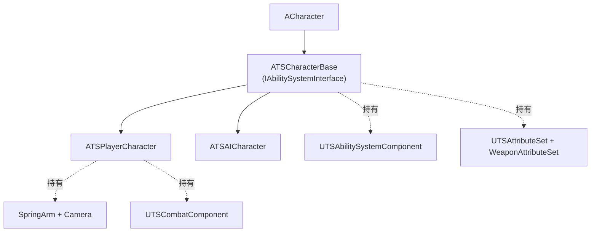
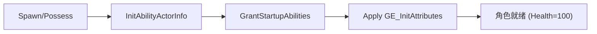

# 模块 2: 角色系统 — 开发文档

> 关联主计划: [../cod-style_tps_demo_cce8f423.plan.md](../cod-style_tps_demo_cce8f423.plan.md)
> 阶段: 1 (核心闭环) | 依赖: 模块1 | 检查点: CP2

---

## 1. 核心目标

建立角色继承体系与 ASC 初始化时机，提供 COD 式越肩相机，作为玩家与 AI 的共同战斗载体。确保 ASC 在 Player（含网络重连场景）与 AI 两条路径上都能正确 init。

---

## 2. 开发地图 (Development Map)

### 2.1 类继承结构

### 2.2 ASC 初始化时机表

| 角色 | 初始化入口 | 原因 |
|---|---|---|
| Player | `PossessedBy` + `OnRep_PlayerState` | 兼容未来网络/PlayerState 持有 ASC 的迁移 |
| AI | `PossessedBy` | AI 无 PlayerState，单点 init 足够 |

### 2.3 相机参数 (越肩 strafe)

| 参数 | 值 |
|---|---|
| `SpringArm.TargetArmLength` | 250 |
| `SpringArm.SocketOffset` | (0, 50, 60) |
| `bUsePawnControlRotation` (SpringArm) | true |
| `bOrientRotationToMovement` (Character) | false |
| `bUseControllerRotationYaw` | true |

### 2.4 角色生成流程

---

## 3. 详细规格

**`ATSCharacterBase`**
- 构造: `ObjectInitializer.SetDefaultSubobjectClass<UTSCharacterMovementComponent>(ACharacter::CharacterMovementComponentName)`
- 成员: `ASC`, `AttributeSet`, `WeaponAttributeSet`, `TArray<TSubclassOf<UTSGameplayAbility>> DefaultAbilities`, `TArray<TSubclassOf<UGameplayEffect>> DefaultEffects`
- `virtual void InitAbilityActorInfo()`、`HandleDeath()`（模块6实现）、`GetAbilitySystemComponent()`

**`ATSPlayerCharacter`**
- `CameraBoom` + `FollowCamera` + `CombatComponent`
- `PossessedBy` / `OnRep_PlayerState` 调用 `InitAbilityActorInfo`
- `SetupPlayerInputComponent`（模块10a 填充）

**`ATSAICharacter`**
- `AIControllerClass = ATSAIController`、`AutoPossessAI = PlacedInWorldOrSpawned`
- 默认武器 DataAsset 引用

---

## 4. 实现步骤

1. 创建 `ATSCharacterBase` + ASC/Attribute 初始化与 init effect。
2. 创建 `ATSPlayerCharacter`（相机、组件、越肩参数）。
3. 创建 `ATSAICharacter`。
4. 蓝图 `BP_TSPlayerCharacter` / `BP_TSEnemy` 配置 DefaultAbilities/Effects/武器。
5. GameMode 默认 Pawn 改为 `BP_TSPlayerCharacter`。

---

## 5. 验收标准 (量化)

| 编号 | 标准 | 量化指标 |
|---|---|---|
| CP2-1 | 玩家生成 | PIE 后玩家出生，相机 TargetArmLength=250、肩部偏移可见（角色偏屏幕左/右侧） |
| CP2-2 | ASC init | `showdebug abilitysystem` 显示玩家 Owner/Avatar 均非空、Health=100 |
| CP2-3 | 朝向策略 | 原地转视角时角色 Yaw 跟随相机（strafe），不自动转向移动方向 |
| CP2-4 | 移动可用 | WASD 移动正常，速度≈450（默认 walk）|
| CP2-5 | AI 角色 | 场景放置 `BP_TSEnemy` 生成成功，`showdebug` 选中后显示其 ASC Health=100 |

---

## 6. 测试证据要求 (必须为可视化证据)

> 朝向/相机类标准必须用视频或帧序列证明，不得用日志或坐标数值替代。

- **证据 A — 越肩视角截图**: PIE 截图显示角色处于屏幕一侧、越肩构图。命名 `CP2-A_over_shoulder.png`。
- **证据 B — strafe 帧序列/短视频**: 录制 2-3 秒：仅转动鼠标视角，角色身体跟随旋转而脚步不前移，导出 ≥4 帧关键帧或 mp4。命名 `CP2-B_strafe.mp4`（或 `CP2-B_strafe_f1..f4.png`）。
- **证据 C — 双角色 ASC 截图**: 分别对玩家与敌人 `showdebug abilitysystem` 截图各一张，显示 Health=100。命名 `CP2-C_player_asc.png` / `CP2-C_enemy_asc.png`。
- 存放 `docs/evidence/module-02/`。
