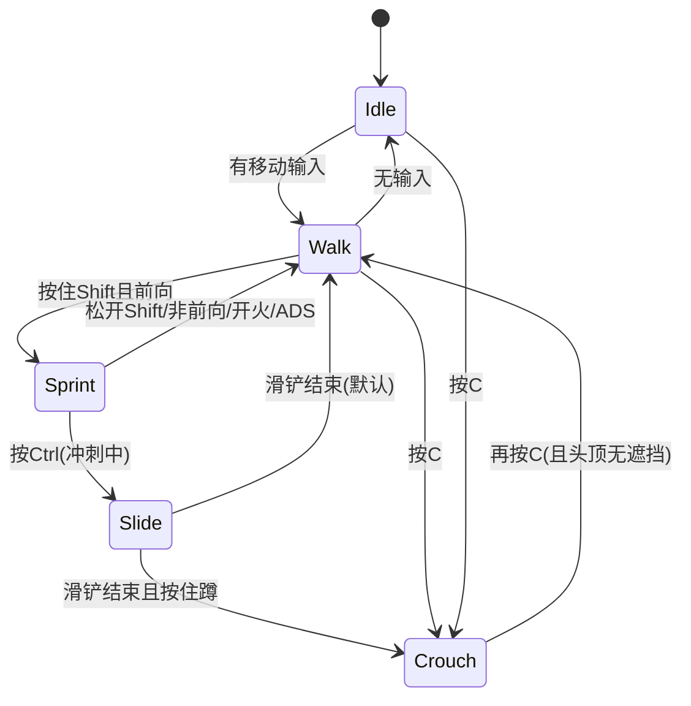

# 模块 3: 移动系统 — 开发文档

> 关联主计划: [../cod-style_tps_demo_cce8f423.plan.md](../cod-style_tps_demo_cce8f423.plan.md)
> 阶段: 1 (核心闭环) | 依赖: 模块1, 模块2, 模块10a | 检查点: CP3

---

## 1. 核心目标

实现 COD 式机动：冲刺(Sprint)、滑铲(Slide)、蹲伏(Crouch)，通过扩展 `UCharacterMovementComponent` + GAS 能力驱动，并用 GameplayTag 管理状态互斥。本模块完成后角色应有完整的地面机动手感（动画在 10b 接入）。

---

## 2. 开发地图 (Development Map)

### 2.1 移动状态机

### 2.2 状态互斥表

| 当前\想进入 | Sprint | Slide | Crouch | ADS | Fire |
|---|---|---|---|---|---|
| **Sprint** | - | 允许 | 允许(退冲刺) | 阻止(先退冲刺) | 阻止(先退冲刺) |
| **Slide** | 阻止 | - | 结束后允许 | 阻止 | 允许(可滑铲中开火,可选) |
| **Crouch** | 允许(起身) | 阻止 | - | 允许 | 允许 |
| **ADS** | 阻止 | 阻止 | 允许 | - | 允许 |

> 规则用 Ability 的 `ActivationBlockedTags` / `ActivationRequiredTags` 实现。例如 `GA_Sprint.ActivationBlockedTags = {State.Combat.ADS, State.Movement.Sliding}`。

### 2.3 速度/参数表

| 参数 | 值 | 说明 |
|---|---|---|
| `MaxWalkSpeed` (walk) | 450 | 默认行走 |
| `SprintSpeed` | 750 | 冲刺（仅前向）|
| `MaxWalkSpeedCrouched` | 250 | 蹲行 |
| `ADS 移速` | 300 | ADS 时压制 |
| `SlideEnterImpulse` | 900 | 滑铲初速 |
| `SlideDuration` | 0.8s | 或速度衰减到 < 350 结束 |
| `SlideFriction` | 0.5 | 滑铲摩擦 |
| `Slide 冷却` | 1.5s | `Cooldown.Slide` |
| Capsule 半高 (站) | 88 | 默认 |
| Capsule 半高 (蹲/滑) | 44 | 蹲伏/滑铲 |

---

## 3. 详细规格

**`UTSCharacterMovementComponent`**
- `CustomMovementMode = CMOVE_Slide`（枚举）
- `bool bWantsToSprint`，`StartSlide()`，`EndSlide()`，覆写 `PhysCustom` 处理滑铲物理、`GetMaxSpeed` 按 tag/状态返回速度。
- 滑铲: 进入降低 capsule、施加前向 impulse，按时间或速度阈值退出。

**`UGA_Sprint`** (WhileInputActive)
- Activate: 加 `State.Movement.Sprinting` → `bWantsToSprint=true`
- 结束条件: 松键 / 无前向输入 / 开火 / ADS
- `ActivationBlockedTags = {State.Combat.ADS}`

**`UGA_Slide`** (OnInputTriggered)
- `ActivationRequiredTags = {State.Movement.Sprinting}`
- Cooldown: `GE_Cooldown_Slide` (`Cooldown.Slide`, 1.5s)
- Activate: 加 `State.Movement.Sliding` → `StartSlide()` → AbilityTask 计时 → 结束移除 tag

**Crouch**: 引擎 `Crouch()/UnCrouch()` + `State.Movement.Crouching` tag，起身检测头顶遮挡。

---

## 4. 实现步骤

1. 扩展 MovementComponent（速度逻辑 + 滑铲自定义模式）。
2. 实现 `GA_Sprint`。
3. 实现 `GA_Slide` + `GE_Cooldown_Slide`。
4. 接 Crouch（角色函数 + tag）。
5. 在角色 DefaultAbilities 注册三者，绑定输入（模块10a）。

---

## 5. 验收标准 (量化)

| 编号 | 标准 | 量化指标 |
|---|---|---|
| CP3-1 | 冲刺提速 | 前进按 Shift，速度从 450 升至 750 (±10)；`stat` 或速度显示验证 |
| CP3-2 | 冲刺退出 | 松 Shift / 改后退时 0.2s 内回落到 ≤450 |
| CP3-3 | 滑铲位移 | 冲刺中按 Ctrl，capsule 半高 88→44，前冲位移 ≥ 3m，持续 ~0.8s |
| CP3-4 | 滑铲冷却 | 连续触发被拦截，两次成功滑铲间隔 ≥ 1.5s |
| CP3-5 | 蹲伏 | 按 C 后 capsule 半高 44、移速 ≤250；头顶有遮挡时无法起身 |
| CP3-6 | 互斥 | ADS 状态下无法进入冲刺（`showdebug` tag 列表验证无 Sprinting tag）|

---

## 6. 测试证据要求 (必须为可视化证据)

> 移动手感类标准必须用帧序列或短视频证明，不接受纯日志/速度数值打印。

- **证据 A — 冲刺对比帧序列**: 同一直线段，walk 与 sprint 各录一段，叠加 `stat fps` 与速度 HUD，对比相同时间内位移差。命名 `CP3-A_sprint_vs_walk.mp4`。
- **证据 B — 滑铲帧序列**: 录制完整滑铲（起手/滑行/结束）≥6 帧，可见 capsule 高度下降与前冲。命名 `CP3-B_slide_f1..f6.png` 或 `CP3-B_slide.mp4`。
- **证据 C — 蹲伏截图**: 站立与蹲伏两张对比截图，可见角色/capsule 高度变化。命名 `CP3-C_stand.png` / `CP3-C_crouch.png`。
- **证据 D — 互斥证据**: ADS 状态下尝试冲刺，截取屏幕 + `showdebug abilitysystem` tag 区显示无 `Sprinting`。命名 `CP3-D_mutex_ads_sprint.png`。
- 存放 `docs/evidence/module-03/`。
