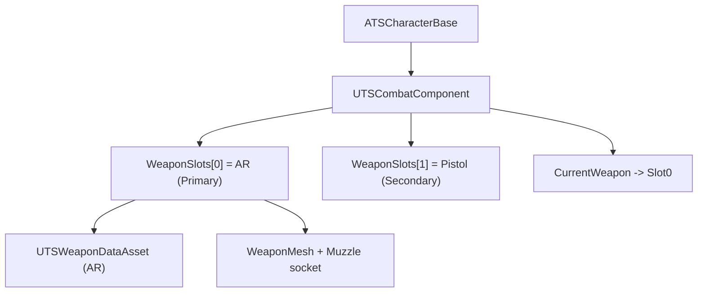
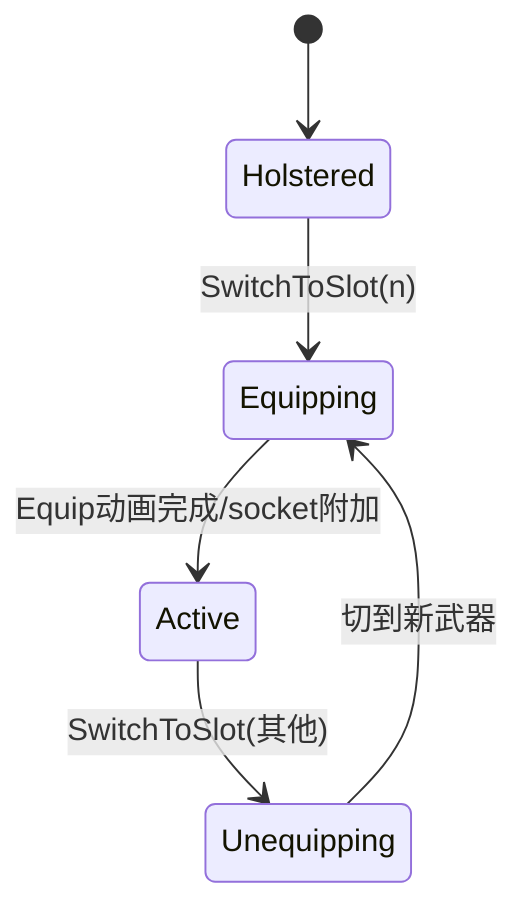

# 模块 4: 武器系统 — 开发文档

> 关联主计划: [../cod-style_tps_demo_cce8f423.plan.md](../cod-style_tps_demo_cce8f423.plan.md)
> 阶段: 2 (战斗闭环) | 依赖: 模块2 | 检查点: CP4

---

## 1. 核心目标

建立数据驱动的武器体系：用 DataAsset 描述武器参数，WeaponBase Actor 承载网格与运行时弹药，CombatComponent 管理双武器槽的持有/附加/切换。本模块为射击能力（模块5）提供数据与实体基础。

---

## 2. 开发地图 (Development Map)

### 2.1 类/资产清单

| 对象 | 父类/类型 | 文件/位置 | 职责 |
|---|---|---|---|
| `EWeaponSlot` | enum | `Weapon/TSWeaponTypes.h` | Primary/Secondary |
| `UTSWeaponDataAsset` | `UPrimaryDataAsset` | `Weapon/TSWeaponDataAsset.h/.cpp` | 武器静态配置 |
| `ATSWeaponBase` | `AActor` | `Weapon/TSWeaponBase.h/.cpp` | 网格 + 运行时弹药 |
| `UTSCombatComponent` | `UActorComponent` | `Weapon/TSCombatComponent.h/.cpp` | 武器槽管理 |
| `DA_Weapon_AR` / `DA_Weapon_Pistol` | DataAsset 实例 | `Content/TPS/Weapons/` | 具体武器 |

### 2.2 武器持有数据结构

### 2.3 武器数据表 (DEMO 最小集)

| 字段 | AR (突击步枪) | Pistol (手枪) |
|---|---|---|
| Damage | 28 | 45 |
| FireRate (秒/发) | 0.10 | 0.20 |
| bAutomatic | true | false |
| ClipSize | 30 | 12 |
| MaxReserveAmmo | 180 | 60 |
| ReloadTime | 2.3s | 1.5s |
| SpreadHip (度) | 3.0 | 2.0 |
| SpreadADS (度) | 0.5 | 0.4 |
| MaxRange | 10000 | 8000 |
| ADS_FOV | 55 | 60 |

### 2.4 武器切换状态流

---

## 3. 详细规格

**`UTSWeaponDataAsset`**: 见 2.3 字段 + `TSubclassOf<ATSWeaponBase> WeaponClass`、`UAnimMontage* Fire/Reload/EquipMontage`、`UNiagaraSystem* MuzzleFX`、`USoundBase* FireSound`、`FVector ADS_CameraOffset`、`UCurveFloat* RecoilCurve`。

**`ATSWeaponBase`**
- `USkeletalMeshComponent* WeaponMesh`（socket `Muzzle`）
- `UTSWeaponDataAsset* WeaponData`
- 运行时: `int32 CurrentAmmo`, `int32 CurrentReserve`
- `bool CanFire() const`, `void ConsumeAmmo()`, `int32 CalcReloadAmount()`, `FVector GetMuzzleLocation()`

**`UTSCombatComponent`**
- `TArray<ATSWeaponBase*> WeaponSlots`（size 2）, `ATSWeaponBase* CurrentWeapon`, `int32 CurrentSlotIndex`
- `void InitializeWeapons(const TArray<UTSWeaponDataAsset*>&)`、`EquipWeapon/AttachWeaponToHand(hand_r)`、`SwitchToSlot(int32)`、`SwitchNext()`

### 弹药归属决策
按主计划决策：**弹药存武器实例**（`CurrentAmmo/CurrentReserve`），HUD 直接读 `CurrentWeapon`。

---

## 4. 实现步骤

1. 定义 `EWeaponSlot` + `UTSWeaponDataAsset`。
2. 实现 `ATSWeaponBase`（网格 + 弹药 API）。
3. 实现 `UTSCombatComponent`（生成/附加/切换）。
4. 制作 `DA_Weapon_AR` / `DA_Weapon_Pistol` + 武器蓝图（占位网格）。
5. 角色出生装备主武器并附加到 `hand_r`。

---

## 5. 验收标准 (量化)

| 编号 | 标准 | 量化指标 |
|---|---|---|
| CP4-1 | 出生装备 | 玩家出生时 `hand_r` 上有 AR 网格，位置/旋转贴合手部（无穿模/漂移）|
| CP4-2 | 双槽持有 | CombatComponent 持有 2 把武器，CurrentSlotIndex=0 |
| CP4-3 | 切换引用 | 调用 SwitchToSlot(1) 后手部网格变为 Pistol，CurrentWeapon 指向槽1 |
| CP4-4 | 弹药初始化 | AR 显示 CurrentAmmo=30 / Reserve=180；Pistol=12 / 60 |
| CP4-5 | Muzzle socket | `GetMuzzleLocation` 返回点位于枪口处（调试球验证）|

---

## 6. 测试证据要求 (必须为可视化证据)

> 武器外观/附加正确性必须用截图验证，不得仅凭引用指针日志。

- **证据 A — 持枪截图**: 玩家持 AR 的越肩截图，枪贴合右手。命名 `CP4-A_equip_ar.png`。
- **证据 B — 切枪帧序列**: 触发 1→2 切换，截取切换前(AR)与切换后(Pistol)两张。命名 `CP4-B_switch_ar.png` / `CP4-B_switch_pistol.png`。
- **证据 C — Muzzle 调试截图**: 在枪口 `DrawDebugSphere`，截图显示球位于枪管前端。命名 `CP4-C_muzzle.png`。
- **证据 D — 弹药数值截图**: 临时屏幕打印两武器弹药，截图显示 30/180 与 12/60。命名 `CP4-D_ammo.png`。
- 存放 `docs/evidence/module-04/`。
