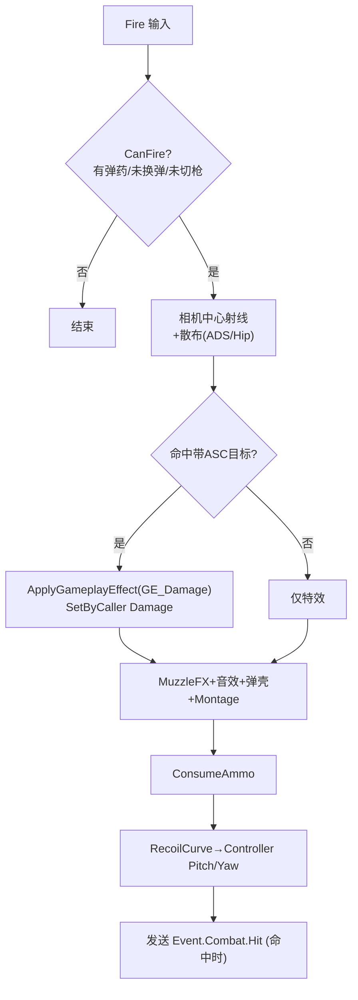

# 模块 5: 射击与战斗能力 — 开发文档

> 关联主计划: [../cod-style_tps_demo_cce8f423.plan.md](../cod-style_tps_demo_cce8f423.plan.md)
> 阶段: 2 (战斗闭环) | 依赖: 模块1, 模块4 | 检查点: CP5

---

## 1. 核心目标

实现 COD 式核心战斗手感的能力层：射击(Fire)、机瞄(ADS)、换弹(Reload)、切枪(WeaponSwitch)，全部以 GameplayAbility 实现，命中通过 GameplayEffect 结算伤害。是整个 DEMO 的"枪感"核心。

---

## 2. 开发地图 (Development Map)

### 2.1 能力清单

| 能力 | 父类 | 激活策略 | 关键 Tag |
|---|---|---|---|
| `UGA_Fire` | `UTSGameplayAbility` | 自动:WhileInputActive / 半自动:OnInputTriggered | `State.Combat.Firing` |
| `UGA_ADS` | `UTSGameplayAbility` | WhileInputActive | `State.Combat.ADS` |
| `UGA_Reload` | `UTSGameplayAbility` | OnInputTriggered | `State.Combat.Reloading` |
| `UGA_WeaponSwitch` | `UTSGameplayAbility` | OnInputTriggered | `State.Weapon.Switching` |

### 2.2 GameplayEffect 清单

| GE | 类型 | 作用 |
|---|---|---|
| `GE_Damage` | Instant | SetByCaller `Data.Damage` → `UTSAttributeSet::Damage` |
| `GE_InitAttributes` | Instant | 初始化 Health/MaxHealth |
| `GE_Cooldown_Slide` | Duration | 授予 `Cooldown.Slide`（模块3共用）|

### 2.3 射击流程

### 2.4 散布与后坐力表

| 状态 | 散布(度) | 来源 |
|---|---|---|
| 腰射静止 | AR 3.0 / Pistol 2.0 | DataAsset SpreadHip |
| ADS | AR 0.5 / Pistol 0.4 | DataAsset SpreadADS |
| 移动中 | Hip × 1.5 | 运行时倍率 |
| 后坐力 | RecoilCurve(连发数) | 每发抬枪 Pitch + 随机 Yaw |

### 2.5 ADS 过渡参数

| 参数 | 腰射 | ADS | 过渡 |
|---|---|---|---|
| Camera FOV | 90 | 55 (AR) | 0.15s 插值 |
| SpringArm SocketOffset | (0,50,60) | ADS_CameraOffset | 0.15s 插值 |
| 移速 | 当前 | 300 | 即时压制 |

---

## 3. 详细规格

**`UGA_Fire`**: LineTrace 从 `Camera Location` 沿 `Camera Forward + 散布` 到 `MaxRange`，`ECC_GameTraceChannel(Weapon)`；命中 ASC 目标 → `MakeOutgoingGameplayEffectSpec(GE_Damage)` + `AssignTagSetByCallerMagnitude(Data.Damage, WeaponDamage)` → `ApplyGameplayEffectSpecToTarget`；自动武器用 `UAbilityTask_WaitDelay` 循环 FireRate。

**`UGA_ADS`**: Activate 插值 FOV/Offset + 加 tag + 压速；End 还原。`UGA_Sprint` 被本 tag 阻止。

**`UGA_Reload`**: 条件 `CurrentAmmo < ClipSize && Reserve > 0`；`PlayMontageAndWait` → 完成回调 `Reload = min(ClipSize-Cur, Reserve)`；`ActivationBlockedTags = {State.Weapon.Switching, State.Dead}`，可被切枪/死亡取消。

**`UGA_WeaponSwitch`**: 条件目标槽有武器且 ≠ 当前；播放 Equip Montage → notify/延时调用 `SwitchToSlot` → 移除 tag；取消进行中的 Reload。

---

## 4. 实现步骤

1. 定义自定义 trace channel `Weapon`。
2. 实现 `GE_Damage` / `GE_InitAttributes`。
3. 实现 `GA_Fire`（trace + 散布 + GE + 后坐力 + 弹药）。
4. 实现 `GA_ADS`（FOV/Offset/速度插值）。
5. 实现 `GA_Reload`、`GA_WeaponSwitch`。
6. 注册到角色 DefaultAbilities，绑定输入。

---

## 5. 验收标准 (量化)

| 编号 | 标准 | 量化指标 |
|---|---|---|
| CP5-1 | 射速 | AR 按住连发，间隔 0.10s (±0.02)；Pistol 单击单发 |
| CP5-2 | 弹道 | 射线起自准心方向；命中点 debug 与准心对齐（屏幕偏差 < 1°）|
| CP5-3 | ADS 过渡 | 右键后 ≤0.15s FOV 90→55、相机贴近；松开还原 |
| CP5-4 | ADS 精度 | ADS 散布 ≤0.5°，腰射 ≥3°（连射弹着分布对比）|
| CP5-5 | 换弹 | R 后经 ReloadTime(2.3s) 弹匣回满，备弹相应减少；换弹中无法开火 |
| CP5-6 | 切枪 | 1/2 切换播放动画后武器更换；切枪打断换弹 |
| CP5-7 | 伤害落地 | 命中带 ASC 目标 Health 减少 = 武器 Damage（AR=28）|

---

## 6. 测试证据要求 (必须为可视化证据)

> 枪感类标准必须用帧序列/短视频，弹道与散布用弹着点截图，不接受纯日志。

- **证据 A — 射速帧序列/视频**: 录制 AR 连发，叠加计时或枪口闪光帧，验证 ~0.10s 间隔。命名 `CP5-A_firerate.mp4`。
- **证据 B — ADS 过渡帧序列**: 右键瞬间起 ≥4 帧，展示 FOV 收窄与相机贴近全过程。命名 `CP5-B_ads_f1..f4.png`。
- **证据 C — 散布对比截图**: 对同一墙面腰射 10 发 vs ADS 10 发的弹着点（debug 标记）两张对比图。命名 `CP5-C_spread_hip.png` / `CP5-C_spread_ads.png`。
- **证据 D — 换弹帧序列**: 空仓→换弹→满仓的弹药 HUD 帧序列（含换弹中尝试开火无效的一帧）。命名 `CP5-D_reload.mp4`。
- **证据 E — 命中扣血截图**: 命中假人前后各一张 `showdebug abilitysystem`（Health 100→72）。命名 `CP5-E_damage_before.png` / `CP5-E_damage_after.png`。
- 存放 `docs/evidence/module-05/`。
