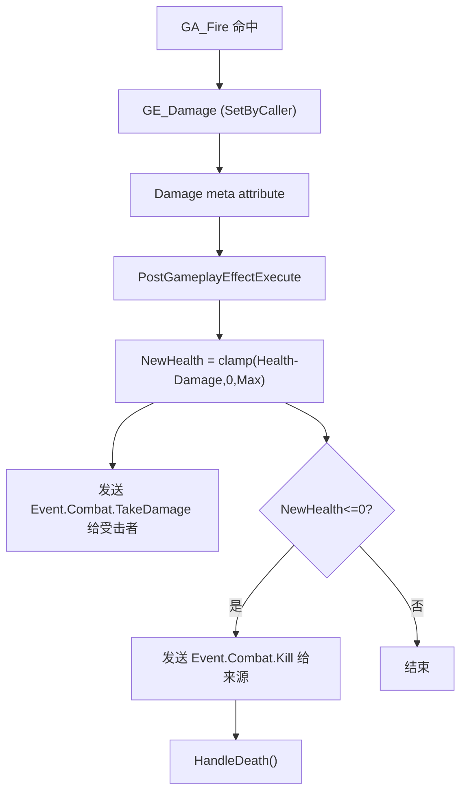
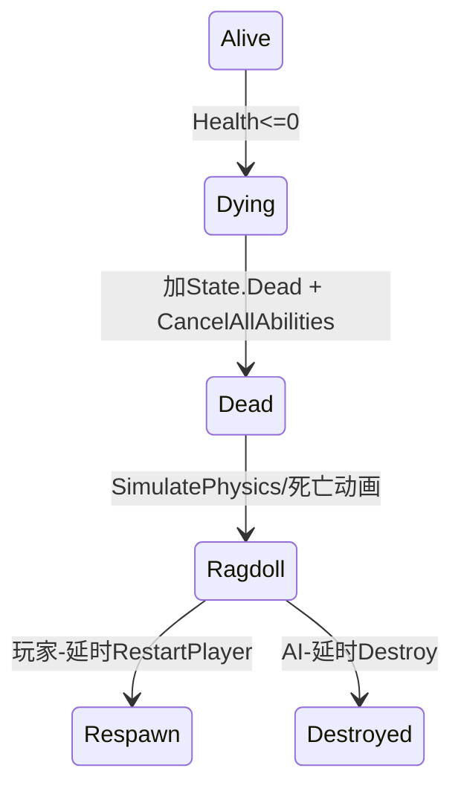

# 模块 6: 生命值与伤害系统 — 开发文档

> 关联主计划: [../cod-style_tps_demo_cce8f423.plan.md](../cod-style_tps_demo_cce8f423.plan.md)
> 阶段: 2 (战斗闭环) | 依赖: 模块1, 模块5 | 检查点: CP6

---

## 1. 核心目标

闭合伤害管线：把 `GE_Damage` 写入的 meta `Damage` 属性结算为 Health 扣减，处理死亡判定、击杀归属、死亡表现与玩家重生。完成后形成"开枪→扣血→死亡→重生"的完整闭环。

---

## 2. 开发地图 (Development Map)

### 2.1 伤害结算数据流

### 2.2 死亡状态流

### 2.3 死亡处理分支表

| 角色 | 死亡表现 | 后续 | 计时 |
|---|---|---|---|
| Player | Ragdoll + 禁输入 | `RestartPlayer` 重生 | 死后 3.0s 重生 |
| AI | Ragdoll | 延时 Destroy + 通知 BT 停止 | 死后 5.0s 清理 |

---

## 3. 详细规格

**`UTSAttributeSet::PostGameplayEffectExecute(const FGameplayEffectModCallbackData& Data)`**
- 仅当 `Data.EvaluatedData.Attribute == GetDamageAttribute()`:
  - `float Local = GetDamage(); SetDamage(0.f);`
  - `SetHealth(FMath::Clamp(GetHealth() - Local, 0.f, GetMaxHealth()));`
  - 从 `Data.EffectSpec.GetContext()` 取 `Instigator`/`SourceASC` 作击杀归属。
  - 组 `FGameplayEventData`（含来源、伤害值）→ `SendGameplayEventToActor(Target, Event.Combat.TakeDamage, Payload)`。
  - 若 `GetHealth() <= 0 && !bDead`：`SendGameplayEventToActor(Source, Event.Combat.Kill, Payload)` + 调用受击者 `HandleDeath()`。

**`ATSCharacterBase::HandleDeath()`**
- 加 `State.Dead`，`ASC->CancelAllAbilities()`。
- 关闭 capsule 碰撞、禁用移动；Mesh `SetSimulatePhysics(true)`（或播死亡 Montage）。
- Player: `DisableInput` + Timer 3.0s → `GetGameMode()->RestartPlayer`。
- AI: 通知 `ATSAIController` StopBT；Timer 5.0s → `Destroy`。

---

## 4. 实现步骤

1. 在 AttributeSet 实现 `PostGameplayEffectExecute` 伤害结算。
2. 加 `bDead` 与击杀归属逻辑，发送两类事件。
3. 实现 `HandleDeath`（Ragdoll/禁用/计时）。
4. Player 重生：GameMode `RestartPlayer` 流程。
5. AI 死亡清理与 BT 停止接口（与模块8对接）。

---

## 5. 验收标准 (量化)

| 编号 | 标准 | 量化指标 |
|---|---|---|
| CP6-1 | 扣血精确 | AR 命中（28）后 Health 100→72；4 发后 ≤0 死亡 |
| CP6-2 | 不为负 | 致命一击后 Health 显示 0.0（非负数）|
| CP6-3 | 死亡表现 | AI 死亡进入 Ragdoll，停止移动/射击 |
| CP6-4 | 击杀归属 | 击杀者收到 `Event.Combat.Kill`（HUD/日志均需，但放行以画面为准）|
| CP6-5 | 玩家重生 | 玩家死亡 3.0s 后在出生点重生，Health 回 100 |
| CP6-6 | AI 清理 | AI 死亡 5.0s 后从场景移除 |

---

## 6. 测试证据要求 (必须为可视化证据)

> 死亡/重生表现必须用帧序列或视频证明，扣血用 `showdebug` 截图。

- **证据 A — 扣血序列截图**: 命中前/命中一发后/四发后三张 `showdebug abilitysystem`，显示 100→72→...→0。命名 `CP6-A_hp_100.png` / `CP6-A_hp_72.png` / `CP6-A_hp_0.png`。
- **证据 B — AI 死亡帧序列/视频**: 录制 AI 中弹→倒地 Ragdoll 全过程 ≥6 帧。命名 `CP6-B_enemy_death.mp4`。
- **证据 C — 玩家重生视频**: 录制玩家死亡→3s→出生点重生（Health 满）的完整过程。命名 `CP6-C_player_respawn.mp4`。
- **证据 D — AI 清理截图**: 死后 5s 时场景中该 AI 已消失的对比截图（死亡瞬间 vs 5s 后）。命名 `CP6-D_cleanup_before.png` / `CP6-D_cleanup_after.png`。
- 存放 `docs/evidence/module-06/`。
