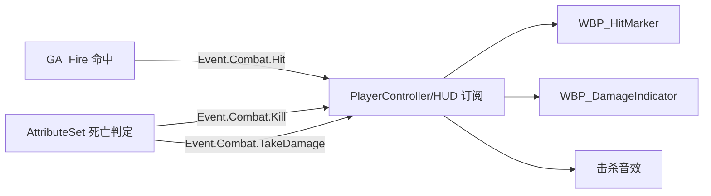

# 模块 7: 命中反馈系统 — 开发文档

> 关联主计划: [../cod-style_tps_demo_cce8f423.plan.md](../cod-style_tps_demo_cce8f423.plan.md)
> 阶段: 3 (体验层) | 依赖: 模块5, 模块6, 模块9 | 检查点: CP7

---

## 1. 核心目标

提供 COD 式即时打击反馈：命中标记(Hitmarker)、击杀确认、受伤方向指示器。通过监听战斗 GameplayEvent 驱动 UI，强化"打中/被打"的感官闭环。

---

## 2. 开发地图 (Development Map)

### 2.1 事件→反馈映射表

| GameplayEvent | 接收者 | 反馈 | 持续 |
|---|---|---|---|
| `Event.Combat.Hit` | 攻击者 | 准心 X 形 Hitmarker（白）| 0.15s 淡出 |
| `Event.Combat.Kill` | 击杀者 | Hitmarker 红色加粗 + 击杀音 | 0.3s + 音效 |
| `Event.Combat.TakeDamage` | 受击者 | 屏幕边缘方向指示器（红弧）| 1.5s 淡出 |

### 2.2 反馈数据流



### 2.3 受伤方向角度计算

```
角度 = atan2( CrossZ(玩家前向, 来源方向), Dot(玩家前向, 来源方向) )
→ 映射到屏幕边缘 360° 弧形位置
```

| 来源相对位置 | 指示器屏幕位置 |
|---|---|
| 正前 (0°) | 屏幕上方中央 |
| 右侧 (90°) | 屏幕右侧 |
| 正后 (180°) | 屏幕下方中央 |
| 左侧 (270°) | 屏幕左侧 |

---

## 3. 详细规格

- 订阅: `ASC->GenericGameplayEventCallbacks.FindOrAdd(Tag).AddUObject(...)` 或在 PlayerController/HUD 用 `AbilitySystemComponent->AddGameplayEventTagContainerDelegate`。
- `WBP_HitMarker`: 收到 Hit → 播放出现+淡出动画（0.15s）；收到 Kill → 切红色样式 + 触发 `USoundBase` 击杀音。
- `WBP_DamageIndicator`: 收到 TakeDamage → 由 payload 来源位置算角度 → 实例化/旋转一个红色弧形控件，1.5s 淡出。
- payload (`FGameplayEventData`): `Instigator`=来源、`OptionalObject`/`EventMagnitude` 携带来源位置或伤害值。

---

## 4. 实现步骤

1. 确保模块5/6 正确发送三类事件 + payload 含来源位置。
2. HUD/Controller 订阅三类事件。
3. 实现 `WBP_HitMarker`（命中/击杀两态 + 音效）。
4. 实现 `WBP_DamageIndicator`（角度计算 + 边缘定位 + 淡出）。
5. 接入击杀音效资源。

---

## 5. 验收标准 (量化)

| 编号 | 标准 | 量化指标 |
|---|---|---|
| CP7-1 | 命中标记 | 命中敌人时准心出现白色 X，0.15s 内淡出 |
| CP7-2 | 击杀标记 | 击杀时 Hitmarker 变红加粗 + 播放击杀音 |
| CP7-3 | 受伤指示方向 | 来源在右侧时指示器出现在屏幕右侧（误差 < 30°）|
| CP7-4 | 指示器时长 | 受伤指示器 1.5s (±0.2) 淡出 |
| CP7-5 | 多源叠加 | 同时被两方向攻击出现两个指示器 |

---

## 6. 测试证据要求 (必须为可视化证据)

> 反馈类全部必须用游戏内截图/录屏，方向准确性用带来源标注的画面证明，禁止仅用事件日志。

- **证据 A — 命中标记截图**: 命中敌人瞬间游戏画面，准心处 Hitmarker 清晰可见。命名 `CP7-A_hitmarker.png`。
- **证据 B — 击杀标记视频**: 录制击杀瞬间，Hitmarker 变红 + 可听到击杀音（含音轨）。命名 `CP7-B_killmarker.mp4`。
- **证据 C — 受伤方向帧序列**: 从不同方向被击，截取至少 3 张（右/后/左），每张标注来源位置与指示器位置一致。命名 `CP7-C_dir_right.png` / `CP7-C_dir_back.png` / `CP7-C_dir_left.png`。
- 存放 `docs/evidence/module-07/`。
