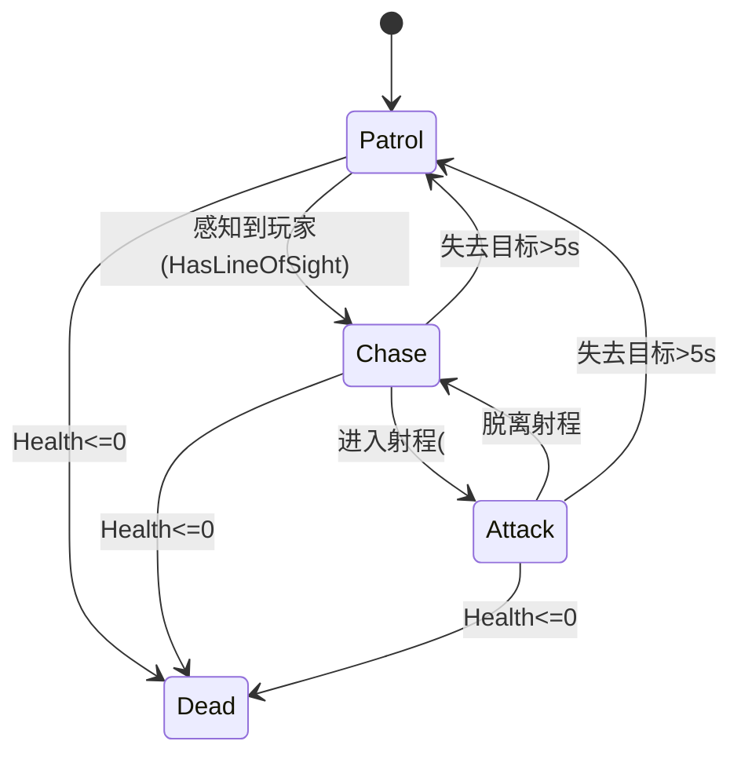
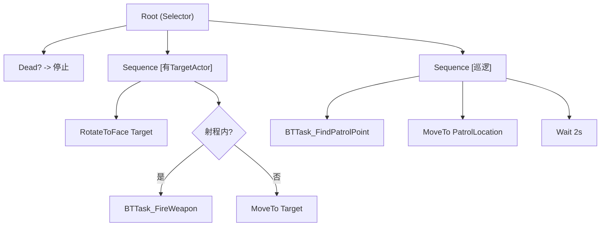

# 模块 8: AI 系统 — 开发文档

> 关联主计划: [../cod-style_tps_demo_cce8f423.plan.md](../cod-style_tps_demo_cce8f423.plan.md)
> 阶段: 3 (体验层) | 依赖: 模块2, 模块5, 模块6 | 检查点: CP8

---

## 1. 核心目标

实现基础敌人 AI：巡逻 → 视觉感知发现玩家 → 追击并射击 → 失去目标后回到巡逻。复用角色 GAS 能力（GA_Fire）作为攻击手段，行为树驱动决策。AI 无限弹药 + 周期换弹动画。

---

## 2. 开发地图 (Development Map)

### 2.1 类/资产清单

| 对象 | 父类/类型 | 文件/位置 |
|---|---|---|
| `ATSAIController` | `AAIController` | `AI/TSAIController.h/.cpp` |
| `UBTTask_FireWeapon` | `UBTTaskNode` | `AI/BTTask_FireWeapon.h/.cpp` |
| `UBTTask_FindPatrolPoint` | `UBTTaskNode` | `AI/BTTask_FindPatrolPoint.h/.cpp` |
| `UBTService_UpdateCombat` | `UBTService` | `AI/BTService_UpdateCombat.h/.cpp` |
| `BT_Enemy` / `BB_Enemy` | BehaviorTree/Blackboard | `Content/TPS/AI/` |

### 2.2 AI 行为状态机

### 2.3 Blackboard Keys

| Key | 类型 | 写入者 |
|---|---|---|
| `TargetActor` | Object | AIController 感知回调 |
| `PatrolLocation` | Vector | BTTask_FindPatrolPoint |
| `HasLineOfSight` | Bool | 感知/Service |
| `IsDead` | Bool | 角色死亡通知 |

### 2.4 行为树结构

### 2.5 感知与战斗参数

| 参数 | 值 |
|---|---|
| 视距 (Sight Radius) | 1500 |
| 失去视野距离 | 1800 |
| 视野角 (半角) | 45° (全 90°) |
| 视觉记忆时长 | 5s |
| AttackRange | 1200 |
| AI 点射时长 | 0.5s / 次 |
| AI 射击间隔 | 1.0s |
| AI 周期换弹 | 每 30 发触发动画 |

---

## 3. 详细规格

**`ATSAIController`**: `UAIPerceptionComponent` + `UAISenseConfig_Sight`（按 2.5）；`OnTargetPerceptionUpdated` → 写 `TargetActor`/`HasLineOfSight`；`OnPossess` → `RunBehaviorTree(BT_Enemy)`；提供 `StopBehavior()`（死亡时模块6调用）。

**`UBTTask_FireWeapon`**: 取 Pawn ASC → `TryActivateAbilityByClass(UGA_Fire)` 持续 0.5s 点射后返回 Succeeded。

**`UBTTask_FindPatrolPoint`**: `UNavigationSystemV1::GetRandomReachablePointInRadius(Origin, 800)` 写 `PatrolLocation`。

**`UBTService_UpdateCombat`**: 周期刷新与目标距离 → 更新射程内/视野状态。

---

## 4. 实现步骤

1. 实现 `ATSAIController` + 感知配置。
2. 创建 `BB_Enemy` 四个 key。
3. 实现三个自定义 BT 节点。
4. 搭建 `BT_Enemy` 行为树。
5. `BP_TSEnemy` 指定 AIController/BT，授予 GA_Fire，配置无限弹药。
6. 与模块6死亡通知对接（StopBehavior）。

---

## 5. 验收标准 (量化)

| 编号 | 标准 | 量化指标 |
|---|---|---|
| CP8-1 | 巡逻 | AI 在 NavMesh 上移动到随机点并等待 2s 循环 |
| CP8-2 | 发现 | 玩家进入 1500 范围 + 视野 90° 内，AI 在 ≤1s 切换为追击 |
| CP8-3 | 攻击 | 进入 1200 射程后 AI 朝玩家点射，能对玩家造成伤害 |
| CP8-4 | 失去目标 | 玩家脱离视野 5s 后 AI 回到巡逻 |
| CP8-5 | 死亡停止 | AI 死亡后立即停止移动/射击（BB IsDead=true）|
| CP8-6 | 命中玩家 | AI 射击可触发玩家受伤反馈（模块7）|

---

## 6. 测试证据要求 (必须为可视化证据)

> AI 行为必须用录屏证明，禁止仅凭黑板值或日志判定通过。

- **证据 A — 巡逻视频**: 录制 AI 巡逻移动 + 等待循环 ≥1 个完整周期。命名 `CP8-A_patrol.mp4`。
- **证据 B — 发现转换视频**: 录制玩家进入视野→AI 转为追击的过程，可见朝向变化。命名 `CP8-B_detect.mp4`。
- **证据 C — 交火视频**: 录制 AI 追击→射程内开火→命中玩家（玩家受伤反馈出现）。命名 `CP8-C_engage.mp4`。
- **证据 D — 失去目标视频**: 录制玩家躲入掩体 5s 后 AI 返回巡逻。命名 `CP8-D_lose_target.mp4`。
- **证据 E — 死亡停止截图**: AI 死亡瞬间截图 + 显示其已停止行为（可叠加 BB IsDead 调试）。命名 `CP8-E_ai_death.png`。
- 存放 `docs/evidence/module-08/`。
