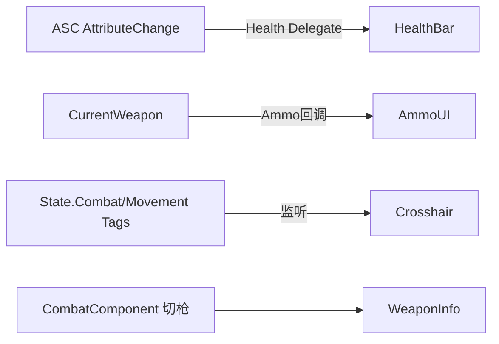

# 模块 9: HUD/UI 系统 — 开发文档

> 关联主计划: [../cod-style_tps_demo_cce8f423.plan.md](../cod-style_tps_demo_cce8f423.plan.md)
> 阶段: 3 (体验层) | 依赖: 模块5, 模块6 | 检查点: CP9

---

## 1. 核心目标

提供 COD 式战斗 HUD：动态准心、弹药、生命值、武器信息，通过 GAS 属性变化委托与武器状态实时驱动。本模块让玩家在屏幕上获得即时战斗信息（命中反馈层在模块7）。

---

## 2. 开发地图 (Development Map)

### 2.1 Widget 清单与数据源

| Widget | 实现 | 数据源 | 更新方式 |
|---|---|---|---|
| `WBP_HUDRoot` | BP | 容器 | 组合 |
| `WBP_Crosshair` | BP | 移动/ADS/Fire 状态 | tag 监听 + Tick 插值 |
| `WBP_AmmoDisplay` | BP | CurrentWeapon | 开火/换弹/切枪回调 |
| `WBP_HealthBar` | BP | AttributeSet Health/MaxHealth | 属性委托 |
| `WBP_WeaponInfo` | BP | CurrentWeapon | 切枪回调 |
| `UTSUserWidget` | C++ | 角色/ASC 引用基类 | 供蓝图继承 |

### 2.2 数据绑定流

### 2.3 动态准心扩散表

| 状态 | 准心间距 (px) |
|---|---|
| 静止站立 | 8 |
| 行走 | 16 |
| 冲刺 | 28 (或隐藏) |
| 开火瞬间 | 当前 +12（衰减回落）|
| ADS | 2 或隐藏（用瞄准镜点）|

---

## 3. 详细规格

- `ATSPlayerHUD`（继承 `AHUD`）或在 `ATSPlayerController::BeginPlay` 用 `CreateWidget` 创建 `WBP_HUDRoot` 并 `AddToViewport`。
- `UTSUserWidget`：缓存 `OwningCharacter`/`ASC`，提供 `NativeConstruct` 注册委托、`OnHealthChanged` 等虚函数供蓝图覆写。
- HealthBar：`ASC->GetGameplayAttributeValueChangeDelegate(GetHealthAttribute()).AddUObject(...)` → `Percent = Health/MaxHealth`。
- AmmoDisplay：绑定武器 `OnAmmoChanged`（开火/换弹/切枪触发）。
- Crosshair：监听移动/ADS tag（`RegisterGameplayTagEvent`）调整间距，开火脉冲用计时回落。

---

## 4. 实现步骤

1. 实现 `UTSUserWidget` C++ 基类。
2. 创建 `WBP_HealthBar` + 属性委托绑定。
3. 创建 `WBP_AmmoDisplay` + 武器回调。
4. 创建 `WBP_Crosshair`（动态扩散）。
5. 创建 `WBP_WeaponInfo` 与 `WBP_HUDRoot` 组装，HUD/Controller 挂载。

---

## 5. 验收标准 (量化)

| 编号 | 标准 | 量化指标 |
|---|---|---|
| CP9-1 | HUD 显示 | 进入 PIE 屏幕显示准心+弹药+血条+武器名 |
| CP9-2 | 弹药同步 | 开火每发弹药 -1；换弹后回满（AR→30）；备弹同步减少 |
| CP9-3 | 血条同步 | 受伤后血条按 Health/MaxHealth 比例缩短（28 伤害≈28%）|
| CP9-4 | 准心动态 | 静止间距 8px、行走 16px、开火脉冲 +12 后回落；ADS 收紧/隐藏 |
| CP9-5 | 切枪刷新 | 切到 Pistol 后弹药显示 12/60、武器名更新 |

---

## 6. 测试证据要求 (必须为可视化证据)

> UI 必须用游戏内截图/录屏证明实际渲染效果，禁止仅用控件层级树或坐标数值作为通过依据。

- **证据 A — HUD 全貌截图**: PIE 游戏画面截图，准心/弹药/血条/武器名清晰可见。命名 `CP9-A_hud_overview.png`。
- **证据 B — 弹药递减帧序列**: 连开 3 发的 HUD 帧序列（30→29→28→27）。命名 `CP9-B_ammo_f1..f4.png`。
- **证据 C — 血条变化截图**: 受伤前后两张游戏画面，血条长度明显变化。命名 `CP9-C_health_before.png` / `CP9-C_health_after.png`。
- **证据 D — 准心动态视频**: 录制静止→行走→开火→ADS 的准心变化。命名 `CP9-D_crosshair.mp4`。
- 存放 `docs/evidence/module-09/`。
