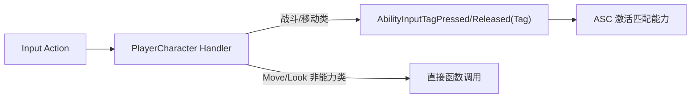

# 模块 10a: 输入骨架 — 开发文档

> 关联主计划: [../cod-style_tps_demo_cce8f423.plan.md](../cod-style_tps_demo_cce8f423.plan.md)
> 阶段: 1 (核心闭环) | 依赖: 模块1, 模块2 | 检查点: CP10a

---

## 1. 核心目标

在现有 `IMC_Default` 基础上扩展全部战斗/移动 Input Action，并建立 "InputAction → GameplayTag → Ability 激活" 的统一绑定通路。本模块只做输入路由，不实现具体能力逻辑（逻辑由模块 3/5 提供）。

---

## 2. 开发地图 (Development Map)

### 2.1 Input Action ↔ Tag 映射表

| Input Action | 类型 | 默认键 | 触发方式 | 目标 Ability Tag |
|---|---|---|---|---|
| `IA_Fire` | Bool | 鼠标左键 | Pressed/Released | `Ability.Fire` |
| `IA_ADS` | Bool | 鼠标右键 | Pressed/Released | `Ability.ADS` |
| `IA_Reload` | Bool | R | Pressed | `Ability.Reload` |
| `IA_Sprint` | Bool | Left Shift | Pressed/Released | `Ability.Sprint` |
| `IA_Crouch` | Bool | C | Pressed (toggle) | 原生 Crouch |
| `IA_Slide` | Bool | Left Ctrl | Pressed | `Ability.Slide` |
| `IA_WeaponSlot1` | Bool | 1 | Pressed | `Ability.WeaponSwitch` |
| `IA_WeaponSlot2` | Bool | 2 | Pressed | `Ability.WeaponSwitch` |
| `IA_WeaponScroll` | Axis1D | 鼠标滚轮 | Triggered | `Ability.WeaponSwitch` |

### 2.2 路由数据流

### 2.3 输入分类

| 类别 | Action | 处理方式 |
|---|---|---|
| 能力类 | Fire/ADS/Reload/Sprint/Slide/WeaponSwitch | 转 ASC tag |
| 原生移动 | Move/Look/Jump | 直接调用（沿用模板）|
| 半原生 | Crouch | 角色函数 + 加 tag |

---

## 3. 详细规格

- 资产位置: `Content/TPS/Input/`，新增 IA 资产 + 更新 `IMC_Default`（或新建 `IMC_TPS`）。
- 可选: `UTSInputConfig`(DataAsset) 维护 `TArray<FTaggedInputAction>`（IA 指针 + InputTag），角色遍历绑定，避免硬编码。
- 绑定在 `ATSPlayerCharacter::SetupPlayerInputComponent`：
  - 能力类: `BindAction(IA, ETriggerEvent::Started, this, &Fn_Pressed)` + `Completed → Fn_Released`，函数体内调用 `ASC->AbilityInputTagPressed/Released(Tag)`。

---

## 4. 实现步骤

1. 创建 9 个 Input Action 资产。
2. 更新 IMC 添加按键映射。
3. （可选）创建 `UTSInputConfig` 映射表。
4. 角色 `SetupPlayerInputComponent` 实现绑定与路由。
5. 临时在各 handler 打 `UE_LOG` 验证。

---

## 5. 验收标准 (量化)

| 编号 | 标准 | 量化指标 |
|---|---|---|
| CP10a-1 | 全键响应 | 9 个 Action 各触发时屏幕 `AddOnScreenDebugMessage` 显示对应 tag 名 |
| CP10a-2 | 按住语义 | Sprint/ADS 的 Pressed 与 Released 分别触发（按下/松开各一次）|
| CP10a-3 | 无冲突 | Move/Look/Jump 仍正常，新增键不覆盖原映射 |
| CP10a-4 | 滚轮轴 | 滚轮上/下各产生一次切换信号（值符号相反）|

---

## 6. 测试证据要求 (必须为可视化证据)

> 必须用屏幕调试信息 (on-screen) 截图证明，不得仅用 Output Log。

- **证据 A — 全键位屏幕反馈截图**: 在 PIE 中依次触发各键，使用 `AddOnScreenDebugMessage` 把 tag 名打在屏幕上，截取包含多条反馈的屏幕。命名 `CP10a-A_onscreen_inputs.png`。
- **证据 B — 按住语义帧序列**: 录制按住再松开 Sprint 的过程，截取 "Sprint Pressed" 帧与 "Sprint Released" 帧两张。命名 `CP10a-B_press.png` / `CP10a-B_release.png`。
- 存放 `docs/evidence/module-10a/`。
