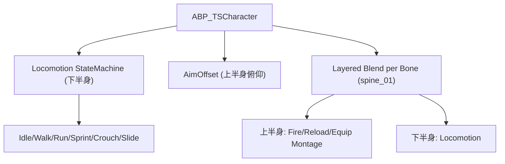
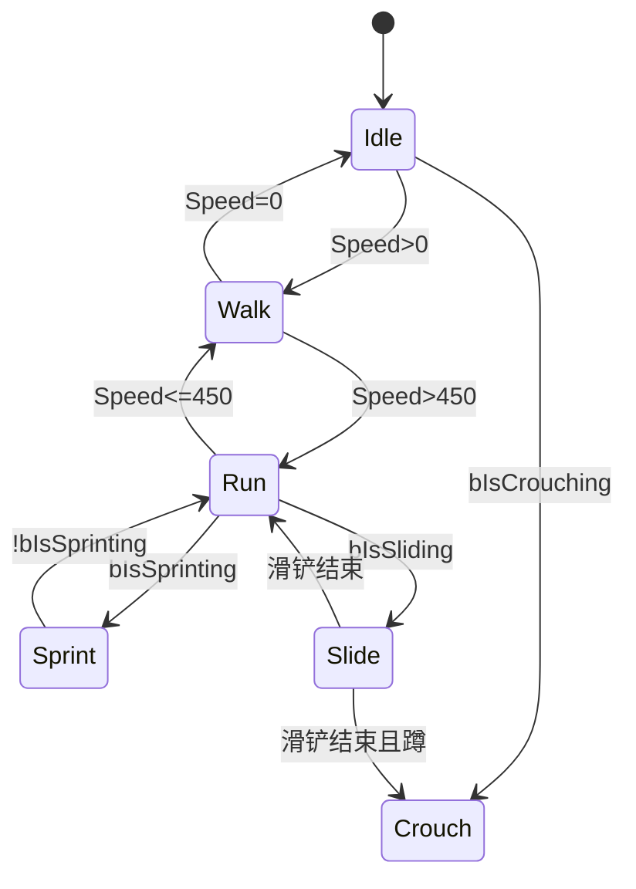

# 模块 10b: 动画系统 — 开发文档

> 关联主计划: [../cod-style_tps_demo_cce8f423.plan.md](../cod-style_tps_demo_cce8f423.plan.md)
> 阶段: 4 (打磨) | 依赖: 模块3, 模块5 | 检查点: CP10b

---

## 1. 核心目标

为已实现的玩法逻辑接入视觉表现：locomotion 状态机、瞄准偏移(AimOffset)、上下半身分层混合(开火/换弹不打断移动)，并把战斗能力的 Montage 接入。先用 Mannequin 占位动画，武器动画后续补充。

---

## 2. 开发地图 (Development Map)

### 2.1 动画蓝图结构

### 2.2 Locomotion 状态机

### 2.3 动画驱动变量表

| 变量 | 来源 | 用途 |
|---|---|---|
| `Speed` | Velocity.Size2D() | locomotion 混合 |
| `Direction` | CalculateDirection() | strafe 四方向 |
| `bIsSprinting` | tag `State.Movement.Sprinting` | Sprint 状态 |
| `bIsCrouching` | tag `State.Movement.Crouching` | Crouch 状态 |
| `bIsSliding` | tag `State.Movement.Sliding` | Slide 状态 |
| `bIsADS` | tag `State.Combat.ADS` | ADS 姿态 |
| `AimPitch/AimYaw` | Controller - Actor 旋转差 | AimOffset |

### 2.4 Montage ↔ 能力对应

| 能力 | Montage | 槽位 | Notify |
|---|---|---|---|
| GA_Fire | FireMontage | UpperBody | 无（或抛壳）|
| GA_Reload | ReloadMontage | UpperBody | `ReloadComplete` 结算弹药 |
| GA_WeaponSwitch | EquipMontage | UpperBody | `WeaponSwap` 切换网格 |
| 受击 | HitReactMontage | UpperBody | 无 |

---

## 3. 详细规格

- `ABP_TSCharacter`：EventGraph 每帧从角色读取速度/方向/tag 状态写入变量；AnimGraph 用 StateMachine + BlendSpace（Strafe 四方向）+ AimOffset + `Layered blend per bone`（base bone = `spine_01`）。
- 能力侧（模块5）的 `PlayMontageAndWait` 指向 DataAsset 中 Montage；Reload 用 `ReloadComplete` notify 触发弹药结算（替代纯计时，更精确对齐动画）。
- 越肩 strafe：因 `bUseControllerRotationYaw=true`，必须用四方向 Strafe 混合空间避免"滑步"。
- 占位策略：Mannequin `BS_Idle_Walk_Run` 作下半身基底；武器持握/开火/换弹动画缺失时先用占位或 retarget。

---

## 4. 实现步骤

1. 创建 `ABP_TSCharacter`，搭 locomotion 状态机 + Strafe 混合空间。
2. 加 AimOffset（上下俯仰）。
3. 加 Layered blend per bone（spine_01 分界）。
4. 各 GA 接 Montage；Reload 加 notify 结算。
5. 角色 Mesh 指定 ABP，验证全状态过渡。

---

## 5. 验收标准 (量化)

| 编号 | 标准 | 量化指标 |
|---|---|---|
| CP10b-1 | locomotion | Idle/Walk/Run/Sprint 随速度切换，无明显滑步 |
| CP10b-2 | strafe | 横向/后退移动时脚步方向与移动方向一致（四方向）|
| CP10b-3 | AimOffset | 上下看时角色上半身俯仰跟随，俯仰范围 ≥ ±60° |
| CP10b-4 | 分层 | 移动中开火/换弹：上半身播放 Montage，下半身保持移动 |
| CP10b-5 | 换弹对齐 | 弹药在 `ReloadComplete` notify 时刻恢复（与动作对齐）|
| CP10b-6 | 蹲/滑 | 蹲伏与滑铲有区别于站立的姿态 |

---

## 6. 测试证据要求 (必须为可视化证据)

> 动画质量必须用录屏/帧序列评估，禁止仅凭变量数值或状态名日志。

- **证据 A — locomotion 视频**: 录制 Idle→Walk→Run→Sprint 连续过渡。命名 `CP10b-A_locomotion.mp4`。
- **证据 B — strafe 帧序列**: 横移与后退各截 ≥3 帧，显示脚步朝向正确。命名 `CP10b-B_strafe_side.png` 等。
- **证据 C — AimOffset 视频**: 录制上下左右看，上半身跟随。命名 `CP10b-C_aimoffset.mp4`。
- **证据 D — 移动中换弹视频**: 录制边跑边换弹，上半身换弹 + 下半身奔跑同时进行。命名 `CP10b-D_move_reload.mp4`。
- 存放 `docs/evidence/module-10b/`。
