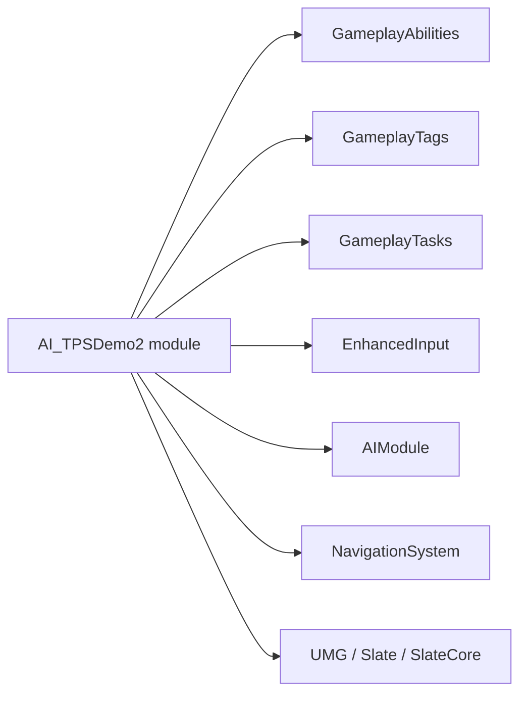

# 阶段 0: 基础设施 — 开发文档

> 关联主计划: [../cod-style_tps_demo_cce8f423.plan.md](../cod-style_tps_demo_cce8f423.plan.md)
> 阶段: 0 (前置) | 依赖: 无 | 检查点: CP0

---

## 1. 核心目标

为整个 GAS-based TPS DEMO 打地基：让工程能引用 GAS/EnhancedInput/AI/UMG 模块并通过编译，建立统一的代码目录与命名约定，初始化版本控制。本阶段不产出任何玩法功能，但任何后续模块都依赖它编译通过。

---

## 2. 开发地图 (Development Map)

### 2.1 改动清单

| 类型 | 对象 | 操作 |
|---|---|---|
| 构建脚本 | `Source/AI_TPSDemo2/AI_TPSDemo2.Build.cs` | 添加模块依赖 |
| 占位类 | `Source/AI_TPSDemo2/MyClass.h/.cpp` | 删除 |
| 配置 | `Config/DefaultGame.ini` | 启用 native GameplayTag |
| 版本控制 | 仓库根目录 | `git init` + `.gitignore` |
| 文档 | `docs/specs/` | 落盘设计文档 |

### 2.2 模块依赖关系



### 2.3 目录结构 (建立空目录 + 约定)

```
Source/AI_TPSDemo2/
├── Core/        (GameMode, PlayerController, AttributeSet, ASC, GA 基类, GameplayTags)
├── Character/   (CharacterBase, Player, AI, MovementComponent)
├── Weapon/      (WeaponBase, WeaponDataAsset, CombatComponent)
├── Abilities/   (GA_*, GE_*)
├── AI/          (AIController, BT 节点)
└── UI/          (PlayerHUD, Widget 基类)

Content/TPS/
├── Blueprints/ Abilities/ Weapons/ Input/ UI/ AI/ Anim/ Maps/
```

---

## 3. 实现步骤

1. 编辑 `AI_TPSDemo2.Build.cs`，`PublicDependencyModuleNames.AddRange` 加入:
   `GameplayAbilities`, `GameplayTags`, `GameplayTasks`, `EnhancedInput`, `AIModule`, `NavigationSystem`, `UMG`, `Slate`, `SlateCore`。
2. 删除 `MyClass.h/.cpp`，从 `.uproject` / 引用处清理。
3. `Config/DefaultGame.ini` 添加 `[/Script/GameplayTags.GameplayTagsSettings]`，确认采用 native tag（代码声明）方案。
4. 在仓库根创建 UE 标准 `.gitignore`（忽略 `Binaries/ Intermediate/ Saved/ DerivedDataCache/ .vs/`），执行 `git init` 与首次提交。
5. 将主设计文档复制到 `docs/specs/2026-06-26-tps-demo-design.md`。
6. 重新生成 VS/Cursor 工程文件，执行 Development Editor 编译。

---

## 4. 验收标准 (量化)

| 编号 | 标准 | 量化指标 |
|---|---|---|
| CP0-1 | 编译通过 | Development Editor 构建 0 error、0 GAS 链接错误；warning 不新增超过 5 条 |
| CP0-2 | 编辑器启动 | 双击 `.uproject` 打开编辑器，加载 `Lvl_ThirdPerson` 用时正常，无弹窗报错 |
| CP0-3 | 模块加载 | `Output Log` 中 `LogModuleManager` 无 `Failed to load`；`stat startfile` 无关键错误 |
| CP0-4 | 版本控制 | `git status` 中 `Saved/` `Intermediate/` `Binaries/` 不出现在跟踪列表；首次提交存在 |
| CP0-5 | 目录就绪 | 6 个 Source 子目录 + `Content/TPS/` 资产目录全部建立 |

---

## 5. 测试证据要求 (必须为可视化证据)

> 本阶段允许编译日志作为辅助，但放行 (CP0 通过) 必须包含以下可视化证据，不得仅凭命令行输出或 headless 构建判定。

- **证据 A — 编辑器成功打开截图**: 截取 UE 编辑器主界面，可见 `Lvl_ThirdPerson` 视口与左下角无错误徽标。
- **证据 B — 编译成功截图**: 截取 IDE/编辑器中 "Build succeeded" 状态栏或 `Compiling complete` 弹窗。
- **证据 C — Content/TPS 目录截图**: 截取 Content Browser 显示 `TPS/` 下子文件夹结构。
- 证据文件命名: `CP0-A_editor_open.png` / `CP0-B_build_ok.png` / `CP0-C_content_tree.png`，统一存放于 `docs/evidence/phase0/`。
